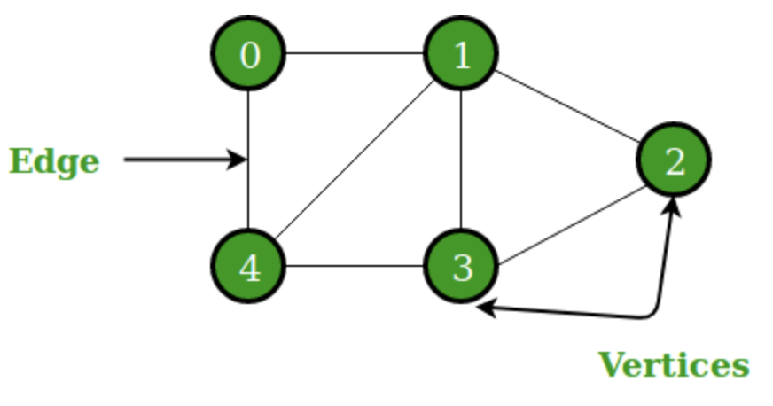
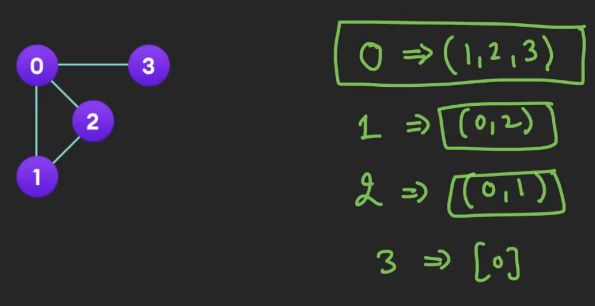
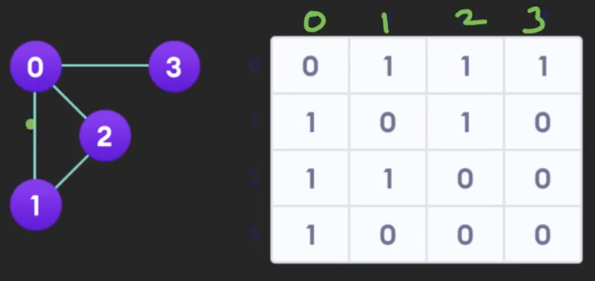
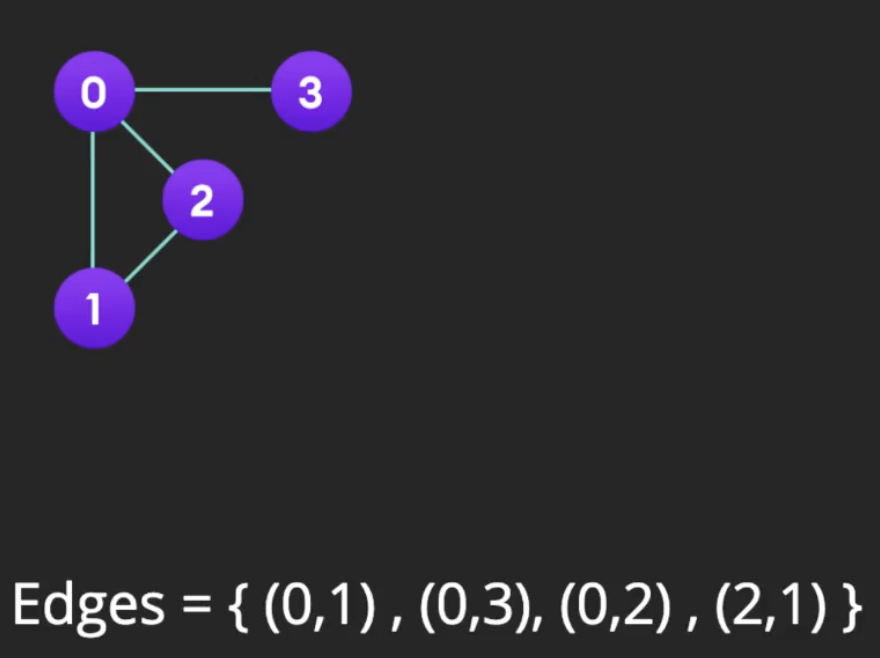

# Graphs

**Graphs** can be used to model many types of relations and processes in physical, biological, social and information systems. Graphs are used to represent networks of communication, data organization, computational devices, the flow of computation, etc.

## About

A graph is a non-linear data structure that consists of nodes (also vertices) and edges. Each item in a graph is called a node (also vertex). Nodes are connected by edges.

## Directed Graph vs Undirected Graph

## Weighted Graph vs Unweighted Graph

## Storing Graphs

### Adjacency List

- Pros:
    - Get neighbors/add nodes in $O(1)$
    - Space efficient

### Adjacency Matrix

- Cons:
    - Takes up $O(n^2)$ space
    - Get neighbors in $O(n)$

### Edge List

- Pros:
    - Great for when it's a weighted graph (just sort by weight)

- Cons:
    - Find neighbors of a node in $O(n)$

### Implicit Graph

An inplicit graph is where the vertices and edges are not explicitly represented (for example the Flood Fill algorithm).

## Graph Applications

- Route Planner Apps
- Social Networks
- Shortest Cyclic Route
- Dependency Graphs
- Routing Algorithms
- Computation Graphs
- Computer Vision
- Web Crawlers
- Physics & Chemistry
- Graph Databases
- And a ***lot*** more!

## Pros & Cons of Graphs

-   Pros:

    -   Represents links

-   Cons:

    -   Scaling challenges

## Graph Use Cases

In the real world, graphs can be applied to many industry problems, such as the social media "Who to follow?" problem or paths from the start to ending position in route planners.

## References

-   [Geeks For Geeks: Graphs](https://www.geeksforgeeks.org/graph-data-structure-and-algorithms/)
