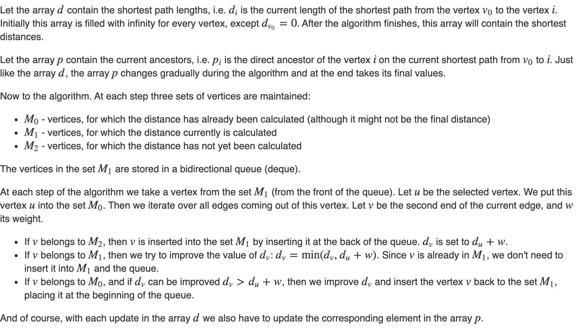

# D´Esopo-Pape Algorithm [(C++)](./desopo-pape.cpp)

## About

Given a graph $G$ with $n$ vertices and $m$ edges with weights $w_i$ and a starting vertex $v_0$. The task is to find the shortest path from the vertex $v_0$ to every other vertex with the average time complexity faster than Dijkstra's and Bellman Ford.

## D´Esopo-Pape Algorithm

**WARNING: The worst-case time complexity for D´Esopo-Pape is exponential.**
