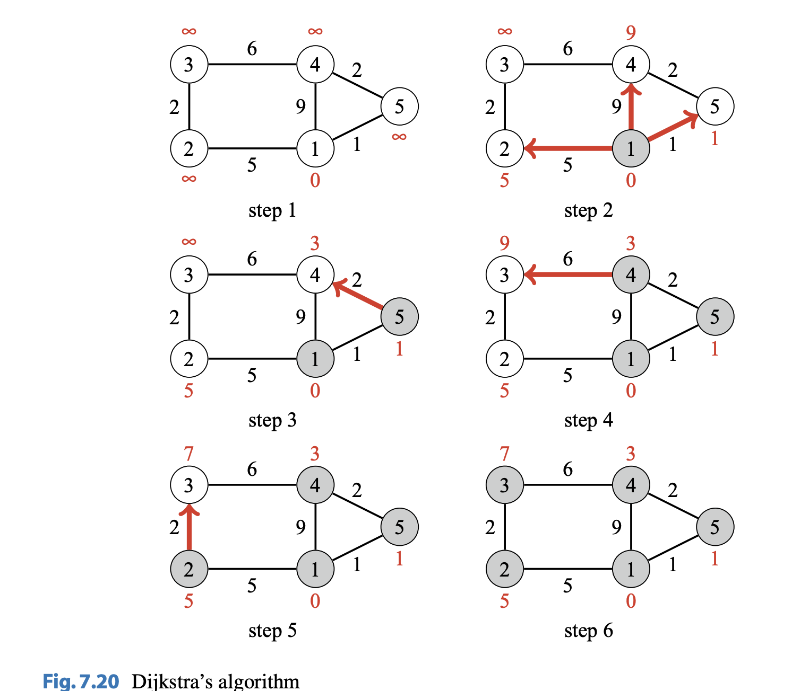

# Dijkstra's Algorithm [(C++)](./dijkstra.cpp)

## About

Dijkstra’s algorithm finds shortest paths from the starting node to all nodes of the graph, like the Bellman–Ford algorithm. The benefit of Dijkstra’s algorithm is that it is more efficient and can be used for processing large graphs. However, the algorithm requires that there are no negative weight edges in the graph.

Like the Bellman–Ford algorithm, Dijkstra’s algorithm maintains distances to the nodes and reduces them during the search. At each step, Dijkstra’s algorithm selects a node that has not been processed yet and whose distance is as small as possible. Then, the algorithm goes through all edges that start at the node and reduces the distances using them. Dijkstra’s algorithm is efficient, because it only processes each edge in the graph once, using the fact that there are no negative edges.

Figure $7.20$ shows how Dijkstra’s algorithm processes a graph. Like in the Bellman–Ford algorithm, the initial distance to all nodes, except for the starting node, is infinite. The algorithm processes the nodes in the order $1$, $5$, $4$, $2$, $3$, and at each node reduces distances using edges that start at the node. Note that the distance to a node never changes after processing the node.



## Implementation of Dijkstra's on Sparse Graphs

An efficient implementation of Dijkstra's algorithm requries that we can efficiently find the minimum distance node that has not been processed. An appropriate data structure for this is the priority queue. With a priority queue, we can retrieve items in logarithmic time.

A typical textbook implementation of Dijkstra’s algorithm uses a priority queue that has an operation for modifying a value in the queue. This allows us to have
a single instance of each node in the queue and update its distance when needed. However, standard library priority queues do not provide such an operation, and a somewhat different implementation is usually used in competitive programming. The idea is to add a new instance of a node to the priority queue always when its distance changes. Our implementation of Dijkstra’s algorithm calculates the minimum distances
from a node $x$ to all other nodes of the graph. The graph is stored as adjacency lists
so that $adj[a]$ contains a pair $(b,w)$ always when there is an edge from node $a$ to
node $b$ with weight $w$. The priority queue contains pairs of the form $(−d, x)$, meaning that the current distance to node $x$ is $d$. The array distance contains the distance to each node, and the array processed indicates whether a node has been processed. Note that the priority queue contains negative distances to nodes. The reason for this is that the default version of the C++ priority queue finds maximum elements, while we want to find minimum elements. By exploiting negative distances, we can directly use the default priority queue. Also note that while there may be several instances of a node in the priority queue, only the instance with the minimum distance will be processed.

The $\theta(n + m \ log \ n)$ implementation is as follows:

```cpp
priority_queue<pair<int,int>> q;

for (int i = 1; i <= n; i++) {
  distance[i] = INF;
}

distance[x] = 0;
q.push({0,x});

while (!q.empty()) {
  int a = q.top().second; q.pop();

  if (processed[a]) continue;

  processed[a] = true;

  for (auto u : adj[a]) {
    int b = u.first,w = u.second;

    if (distance[a] + w < distance[b]) {
      distance[b] = distance[a]+w;
      q.push({-distance[b],b});
    }
  }
}
```

## Implementation of Dijkstra's on Dense Graphs

A $\theta(n^2 + m)$ solution:

Dijkstra's algorithm performs $n$ iterations. On each iteration it selects an unmarked vertex $v$ with the lowest value $d[v]$, marks it and checks all the edges $(v,\text{to})$ attempting to improve the value $d[\text{to}]$.

The running time of the algorithm consists of:

-   $n$ searches for a vertex with the smallest value $d[v]$ among $\theta(n)$ unmarked vertices
-   $m$ relaxation attempts

For the simplest implementation of these operations on each iteration vertex search requires $\theta(n)$ operations, and each relaxation can be performed in $\theta(1)$.

```cpp
const int INF = 1000000000;
vector<vector<pair<int, int>>> adj;

void dijkstra(int s, vector<int> & d, vector<int> & p) {
    int n = adj.size();
    d.assign(n, INF);
    p.assign(n, -1);
    vector<bool> u(n, false);

    d[s] = 0;
    for (int i = 0; i < n; i++) {
        int v = -1;
        for (int j = 0; j < n; j++) {
            if (!u[j] && (v == -1 || d[j] < d[v]))
                v = j;
        }

        if (d[v] == INF)
            break;

        u[v] = true;
        for (auto edge : adj[v]) {
            int to = edge.first;
            int len = edge.second;

            if (d[v] + len < d[to]) {
                d[to] = d[v] + len;
                p[to] = v;
            }
        }
    }
}
```
