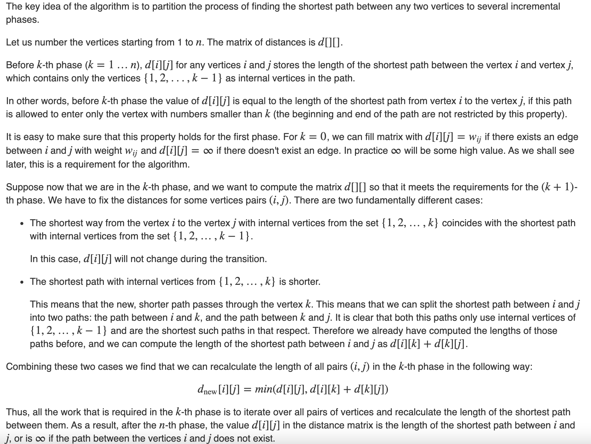

# Floyd-Warshall Algorithm [(C++)](./floyd-warshall.cpp)

## About

Given a undirected weighted graph $G$ with $n$ vertices. The task is to find the length of the shortest path $d_{ij}$ between each pair of vertices $i$ and $j$. The graph may have negative weight edges, but no negative weight cycles. If there exists a negative weight cycle, we can keep traversing the cycle over and over, making the weight smaller and smaller, so negative weight cycles are not allowed.

This algorithm can also be used to detect the presence of negative cycles. The graph has a negative cycle if at the end of the algorithm, the distance from a vertex $v$ to itself is negative.

## The Idea



A last remark - we don't need to create a separate distance matrix $d_{new}[][]$ for temporarily storing the shortest paths of the $k$-th phase, i.e. all changes can be made directly in the matrix $d[][]$ at any phase. In fact at any $k$-th phase we are at most improving the distance of any path in the distance matrix, hence we cannot worsen the length of the shortest path for any pair of the vertices that are to be processed in the $(k+1)$-th phase or later.

The time complexity of this algorithm is $\theta(n ^ 3)$.

## Implementation

Let $d[][]$ is a 2D array of size $n * n$, which is filled according to the $0$-th phase as explained earlier. Also we will set $d[i][i]=0$ for any $i$ at the $0$-th phase.

Then the algorithm is implemented as follows:

```cpp
for (int k = 0; k < n; ++k) {
    for (int i = 0; i < n; ++i) {
        for (int j = 0; j < n; ++j) {
            d[i][j] = min(d[i][j], d[i][k] + d[k][j]);
        }
    }
}
```

It is assumed that if there is no edge between any two vertices $i$ and $j$, then the matrix at $d[i][j]$ contains a large number (large enough so that it is greater than the length of any path in this graph - this number is denoted as $\infty$). Then this edge will always be unprofitable to take, and the algorithm will work correctly.

However if there are negative weight edges in the graph, special measures have to be taken. Otherwise the resulting values in matrix may be of the form $\infty - 1$, $\infty - 2$, etc., which, of course, still indicates that between the respective vertices doesn't exist a path. Therefore, if the graph has negative weight edges, it is better to write the Floyd-Warshall algorithm in the following way, so that it does not perform transitions using paths that don't exist.

```cpp
for (int k = 0; k < n; ++k) {
    for (int i = 0; i < n; ++i) {
        for (int j = 0; j < n; ++j) {
            if (d[i][k] < INF && d[k][j] < INF)
                d[i][j] = min(d[i][j], d[i][k] + d[k][j]);
        }
    }
}
```
