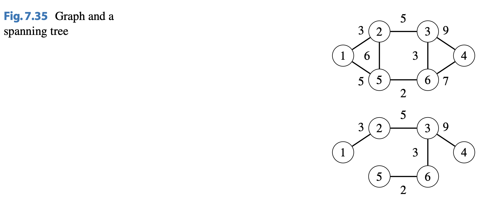
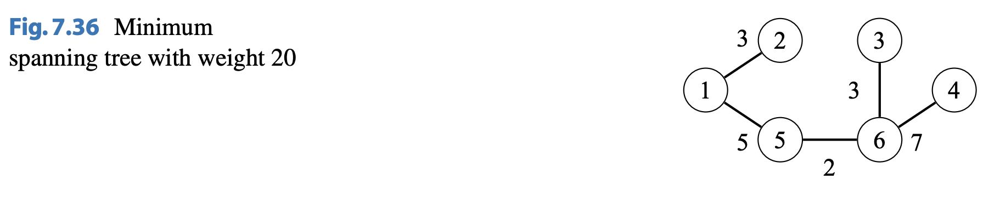
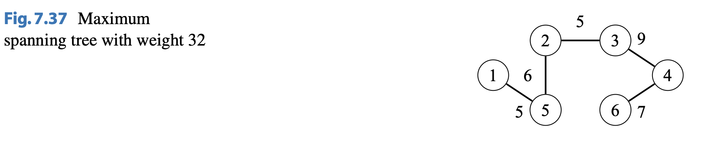
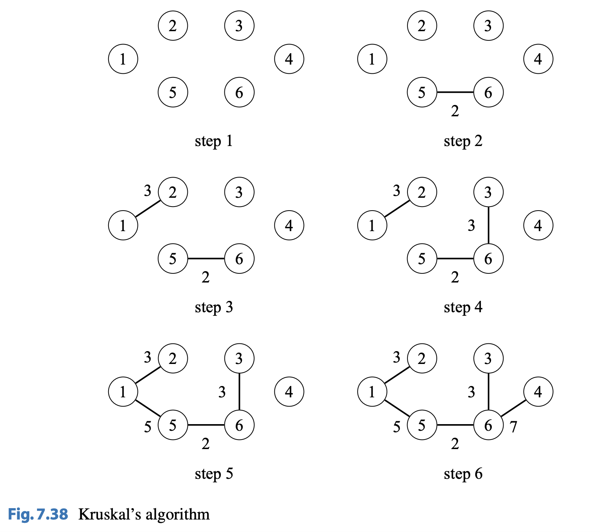
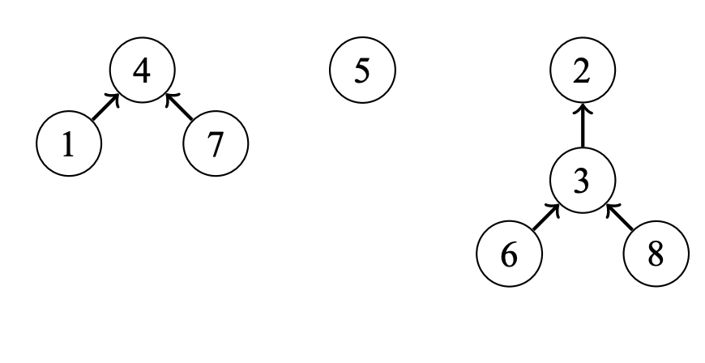
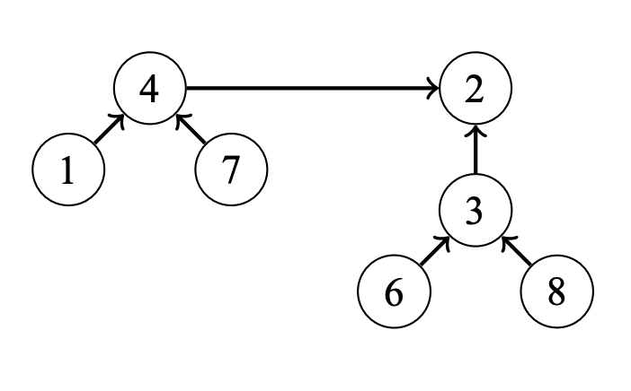
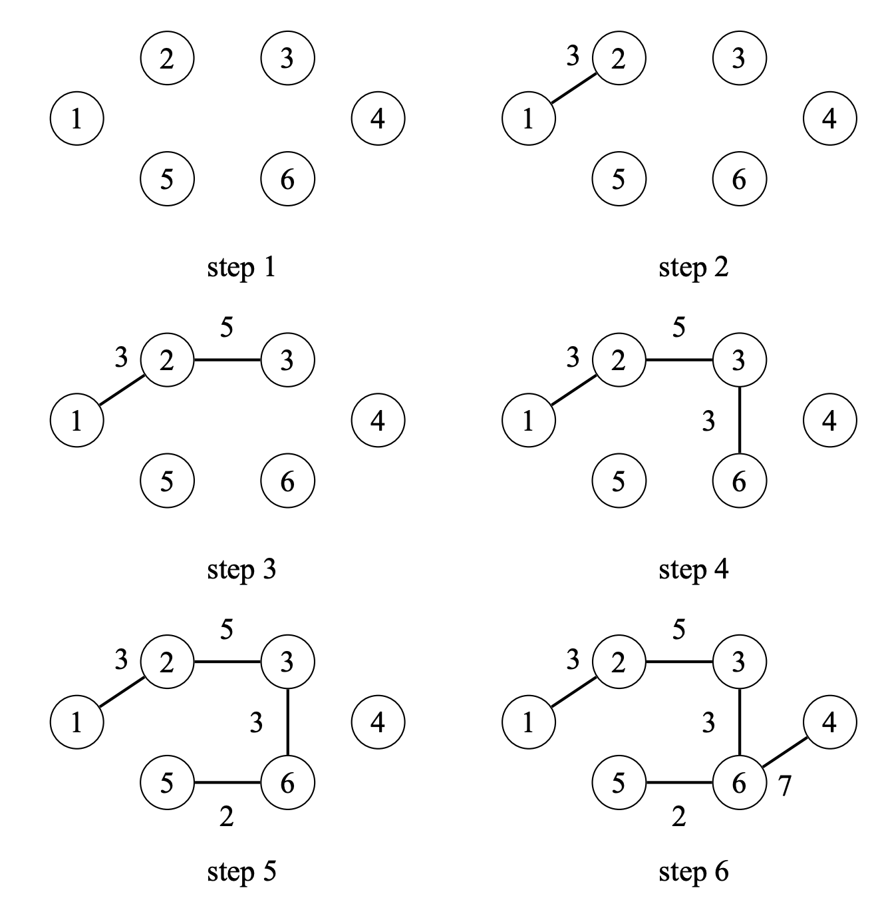

# Spanning Trees

## About

A spanning tree contains all nodes of a graph and some edges such that there is a path between any two nodes $a$ and $b$. Note that there are two types of spanning trees:

-   minimum spanning tree: a graph whose weight is the smallest
-   maximum spanning tree: a graph whose weight is the largest

## Example

Suppose we have the following graph:



The minimum spanning tree of the graph has a weight of 20:



The maximum spanning tree of the graph has a weight of 32:



**ℹ️ NOTE: A graph may have multiple minimum and maximum spanning trees.**

## Creating Spanning Trees

### Kruskal's Algorithm

#### About

Kruskal's Algorithm builds a minimum spanning tree by greedily adding edges to a graph that initially contains the nodes of the original graph and no edges. The algorithm goes through the edges of the original graph (ordered by their weights) and always adds an edge to the new graph if the edge doesn't create a cycle.

The algorithm maintains the components of the new graph. Initially, each node of the graph belongs to separate components. Then, when an edge is added to the graph, two components are joined. Finally, add nodes become as one component, and a minimum spanning tree has been found.



#### Implementation

Implementing Kruskal's algorithm is a task focused on efficiency. For storing the graph, it is convenient to store it as a edge list. Then, we sort the edges in the list by weight. As an example, after sorting, here's the input data:

```
edge | weight
5–6  | 2
1–2  | 3
3–6  | 3
1–5  | 5
2–3  | 5
2–5  | 6
4–6  | 7
3–4  | 9
```

Next, we build the minimum spanning tree:

```cpp
for (;;) {
  // If the nodes are not in the same components, connect the nodes
  if (differentComponents(a, b)) connect(a, b);
}
```

The problem is: how do we **efficiently** implement these two functions? To solve this problem, we can use a union-find data structure that implements both functions in $\theta(log \ n)$ time. Using this idea, we can implement Kruskal's algorithm in $\theta(m \ log \ n)$ time.

##### Union-Find Structure

A union-find structure maintains a collection of sets. The sets are disjoint (no two elements belong to more than one set). In a Union-Find structure, two $\theta(log \ n)$ operations are supported:

-   `unite`: join two sets
-   `find`: find the representative of a set that contains the given element

In a union-find structure, one element in each set is the representative of a set, and there is a path between any element of the set to the representative.

---

Assume that we have the following set:



The representative of the sets are:

-   $\{ 1, 4, 7 \}$: $4$
-   $\{ 5 \}$: $5$
-   $\{ 6, 3, 2, 8 \}$: $2$

---

To `join` two sets, we join the representative of the smaller set to the representative of the bigger set. For example, we can join the set $\{ 1, 4, 7 \}$ and $\{ 6, 3, 2, 8 \}$ as shown:



### Prim's Algorithm

Prim’s algorithm is an alternative method for constructing minimum spanning trees. The algorithm first adds an arbitrary node to the tree, and then always chooses a minimum weight edge that adds a new node to the tree. Finally, all nodes have been added and a minimum spanning tree has been found.

Prim’s algorithm resembles Dijkstra’s algorithm. The difference is that Dijkstra’s algorithm always selects a node whose distance from the starting node is minimum, but Prim’s algorithm simply selects a node that can be added to the tree using a minimum weight edge.

As an example, the steps below shows how Prim’s algorithm constructs a minimum spanning tree for our example graph, assuming that the starting node is node 1.


