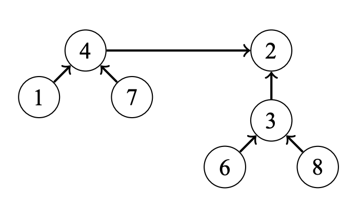

# Kruskal's Algorithm [(C++)](./kruskal.cpp)

## About

### **[What's a Minimum Spanning Tree(MST)?](https://en.wikipedia.org/wiki/Minimum_spanning_tree)**

Given a weighted, undirected graph $G$ with $n$ vertices and $m$ edges. You want to find a spanning tree of this graph which connects all vertices and has the least weight (i.e. the sum of weights of edges is minimal). A spanning tree is a set of edges such that any vertex can reach any other by exactly one simple path. The spanning tree with the least weight is called a minimum spanning tree.

## Idea

Kruskal's algorithm initially places all the nodes of the original graph isolated from each other, to form a forest of single node trees, and then gradually merges these trees, combining at each iteration any two of all the trees with some edge of the original graph. Before the execution of the algorithm, all edges are sorted by weight (in non-decreasing order). Then begins the process of unification: pick all edges from the first to the last (in sorted order), and if the ends of the currently picked edge belong to different subtrees, these subtrees are combined, and the edge is added to the answer. After iterating through all the edges, all the vertices will belong to the same sub-tree, and we will get the answer.

For connecting the subtrees and checking if the subtrees are connected, we will use the [Disjoint Set](https://github.com/aaronhma/algorithms/blob/master/data-structure/non-linear/set/disjoint-set.md) data structure.


Kruskal's algorithm runs in $\theta(m \ log \ n)$ and is most optimal on sparse graphs and also works on disconnected components.

## Implementation

Implementing Kruskal's algorithm is a task focused on efficiency. For storing the graph, it is convenient to store it as a edge list. Then, we sort the edges in the list by weight. As an example, after sorting, here's the input data:

```
edge | weight
5–6  | 2
1–2  | 3
3–6  | 3
1–5  | 5
2–3  | 5
2–5  | 6
4–6  | 7
3–4  | 9
```

Next, we build the minimum spanning tree:

```cpp
for (;;) {
  // If the nodes are not in the same components, connect the nodes
  if (differentComponents(a, b)) connect(a, b);
}
```

The problem is: how do we **efficiently** implement these two functions? To solve this problem, we can use a union-find data structure that implements both functions in $\theta(log \ n)$ time. Using this idea, we can implement Kruskal's algorithm in $\theta(m \ log \ n)$ time.

##### Union-Find Structure

A union-find structure maintains a collection of sets. The sets are disjoint (no two elements belong to more than one set). In a Union-Find structure, two $\theta(log \ n)$ operations are supported:

-   `unite`: join two sets
-   `find`: find the representative of a set that contains the given element

In a union-find structure, one element in each set is the representative of a set, and there is a path between any element of the set to the representative.

---

Assume that we have the following set:


The representative of the sets are:

-   $\{ 1, 4, 7 \}$: $4$
-   $\{ 5 \}$: $5$
-   $\{ 6, 3, 2, 8 \}$: $2$

---

To `join` two sets, we join the representative of the smaller set to the representative of the bigger set. For example, we can join the set $\{ 1, 4, 7 \}$ and $\{ 6, 3, 2, 8 \}$ as shown:


