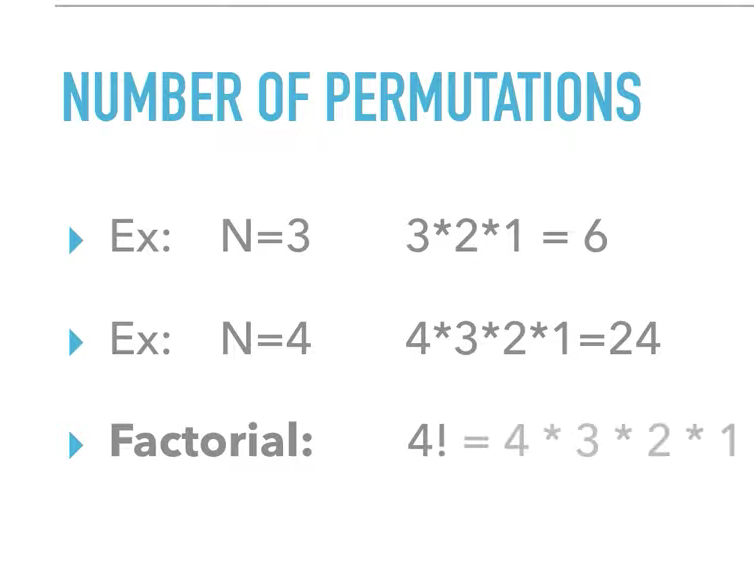

# Heap’s Algorithm [C++](./heap.cpp)

## About

Heap's algorithm generates all possible permutations of $n$ objects. It was first proposed by B. R. Heap in $1963$. The algorithm minimizes movement: it generates each permutation from the previous one by interchanging a single pair of elements; the other $n - 2$ elements are not disturbed.

## Number of Permutations For $n$ Numbers

We can see that if there is $n$ elements, there are $n!$ permutations, which is why all permutation-generating algorithms takes $\theta(n!)$ (worst case).

## Frequent Mis-Implementations

The frequent mis-implementations is highlighted in the code. For more information, see the [Wikipedia article](https://en.wikipedia.org/wiki/Heap%27s_algorithm#Frequent_mis-implementations).
