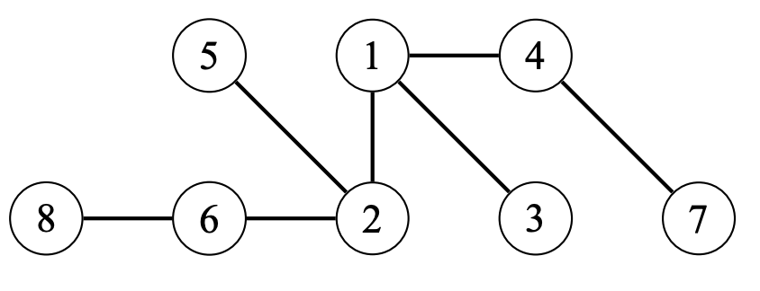
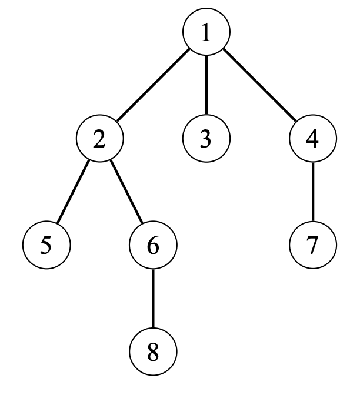

# Trees

## About

A tree is a connected acyclic (no cycles) graph with $n$ nodes and $n - 1$ edges. Removing any edge from the tree divides it into two components, and adding any edge creates a cycle. There is **always** a unique path between any two nodes of a tree. The leaves of the tree are the nodes with only one neighbor. An example of a tree is shown:



## Rooted Trees

In a rooted tree, one of the nodes is the root of the tree, and all other nodes are placed underneath the root. The lower neighbors of a node are called the node's children, and the upper neighbor of a node is called its parent. Each node has exactly one parent, except for the root that does not have a parent. The structure of a rooted tree is recursive: Each node of the tree acts as the root of a subtree that contains the node and all the nodes that are in the subtrees of its children. A rooted tree where node $1$ is the root node is shown:



## Tree Traversals

General graph traversal algorithms can be used on trees, but we can implement a more efficient Depth-First Search specifically for trees. The following recursive function can be used:

```cpp
void dfs(int node, int prev) {
  // explore neighbors of the current node
  for (auto i : adj[node]) {

    // not visited this node yet
    if (i != prev)
      dfs(i, node);
  }
}
```

The function is given two parameters:

-   `node`: The current node being explored.
-   `prev`: The previous node explored. This prevents the node from going to nodes already visited.

At the beginning, we can call the function as shown:

```cpp
dfs(x, 0);
```

We start at node $x$, and because there is no previous node, $prev = 0$.

The reason this works is because:

1. There are no cycles.
2. It is not possible to reach a node from more than 1 direction.

## Binary Trees

In a binary-tree (also known as a $2$-ary tree), the tree is a rooted tree where no node has more than 2 children. An example of a Binary Tree is shown:


### Binary Tree Traversals

The most popular Binary Tree traversals are:

-   pre-order traversal: (Root, Left, Right)

Using the binary tree from above, the pre-order traversal is:

A → B → D → E → C → F → G

-   in-order traversal: (Left, Root, Right)

Using the binary tree from above, the in-order traversal is:

D → B → E → A → F → C → G

-   post-order traversal: (Left, Right, Root)

Using the binary tree from above, the post-order traversal is:

D → E → B → F → G → C → A

**ℹ️ For more information, view [this video](https://www.udemy.com/course/graph-theory/learn/lecture/19824334#overview).**
