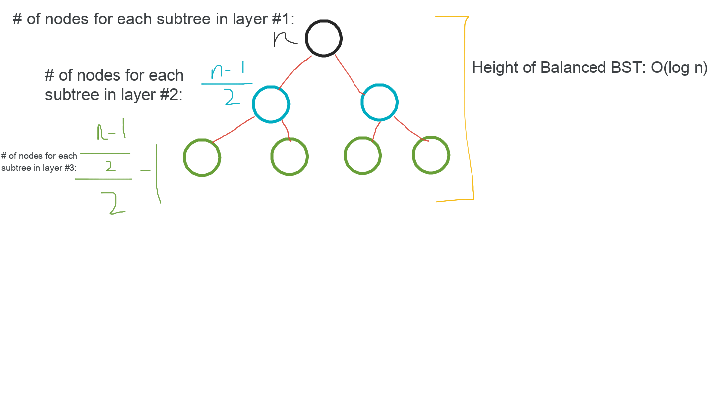

# Binary Search Tree

## Background

A binary search tree is a [binary tree](../binary_tree/README.md) where nodes are always ordered by a properties as shown:

-   left nodes are smaller than the current node
-   right nodes are larger than the current node


([Source](https://www.interviewcake.com/concept/cpp/binary-search-tree))

**NOTE: Checking if a [binary tree](../binary-tree/README.md) is a Binary Search Tree is a common question.**

## Pros & Cons of Binary Search Tree

-   Pros:

    -   Good performance:
        -   All operations: $\theta(log \ n)$ time
        -   Better worst case performance than hash map
    -   BSTs are sorted, so finding closest elements to a value is $
    \theta(log \ n)$ time

-   Cons:
    -   No constant time operations
    -   $\theta(n)$ worst case time if unbalanced to make it balanced

## Balanced vs. Un-balanced BSTs

A balanced binary search tree follows the BST properties along with additional properties:

-   Each node has at most $2$ children
-   The difference between the heights of the left subtree and right subtree cannot be more than $1$
-   Accessing any random element should not take more than $\theta(log \ n)$ time
-   If we have $n$ nodes in the tree, the height should be no more than $ceil(log \ n)$ where $ceil$ rounds $log \ n$ up (if necessary).


([Source](https://www.interviewcake.com/concept/cpp/binary-search-tree))

Also, we can determine the # of nodes for each subtree given the number of nodes in the tree ($n$):



## Deleting from a BST

1. Node to be deleted is the leaf: Simply remove from the tree.

```
              50                            50
           /     \         delete(20)      /   \
          30      70       --------->    30     70
         /  \    /  \                     \    /  \
       20   40  60   80                   40  60   80
```

2. Node to be deleted has only one child: Copy the child to the node and delete the child

```
              50                            50
           /     \         delete(30)      /   \
          30      70       --------->    40     70
            \    /  \                          /  \
            40  60   80                       60   80
```

3. Node to be deleted has two children: Find inorder successor (minimum element on the right) of the node. Copy contents of the inorder successor to the node and delete the inorder successor. Note that inorder predecessor can also be used.

```
              50                            60
           /     \         delete(50)      /   \
          40      70       --------->    40    70
                 /  \                            \
                60   80                           80
```

C++ code:

```cpp
/**
 * Definition for a binary tree node.
 * struct TreeNode {
 *     int val;
 *     TreeNode *left;
 *     TreeNode *right;
 *     TreeNode() : val(0), left(nullptr), right(nullptr) {}
 *     TreeNode(int x) : val(x), left(nullptr), right(nullptr) {}
 *     TreeNode(int x, TreeNode *left, TreeNode *right) : val(x), left(left), right(right) {}
 * };
 */
class Solution {
public:
    TreeNode* deleteNode(TreeNode* root, int key) {
        if (root == NULL) return NULL;

        if (key < root->val)
            root->left = deleteNode(root->left, key);
        else if (key > root->val)
            root->right = deleteNode(root->right, key);
        else {
            if (root->left == NULL && root->right == NULL)
                return NULL;

            if (root->left == NULL) {
                TreeNode *tmp = root->right;
                // free(root);
                return tmp;
            }

            if (root->right == NULL) {
                TreeNode *tmp = root->left;
                // free(root);
                return tmp;
            }


            TreeNode *tmp = root->right;

            while (tmp->left != NULL) {
                tmp = tmp->left;
            }

            root->val = tmp->val;

            root->right = deleteNode(root->right, tmp->val);
        }

        return root;
    }
};
```

## Bonus: What BST means

-   B: Binary - The tree is a [binary tree](../binary-tree/README.md).
-   S: Search - The tree is organized in a fashion suitable for sorting (see BST properties).
-   T: Tree - It's a tree.

## References

-   [Interview Cake: Binary Search Tree](https://www.interviewcake.com/concept/cpp/binary-search-tree)
