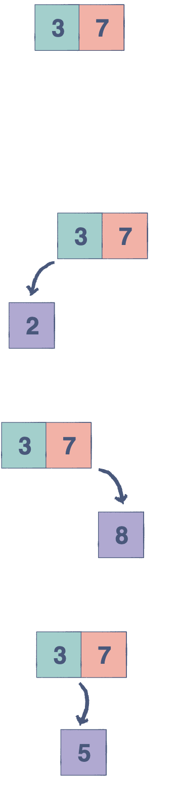
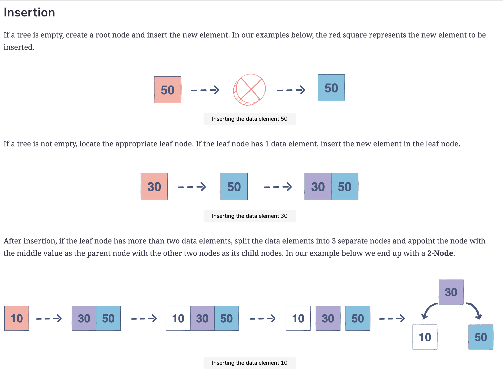
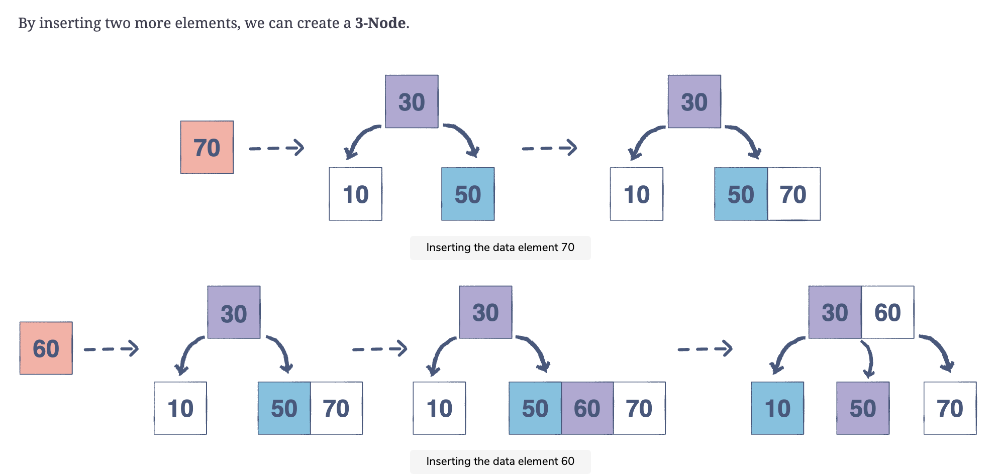

# Special Trees

## 2-3 Tree

A 2-3 Tree is a multiway search tree that allows insertion, deletion, and searching in $\theta(log \ n)$. It’s a self-balancing tree; it’s always perfectly balanced with every leaf node at equal distance from the root node.

Other than the leaf nodes, every node can be one of two types:

* 2-Node: A node with a single data element that has two child nodes
* 3-Node: A node with two data elements that has three child nodes

### Structure of a 2-Node

Like a binary search tree, when a node only contains one data element the left subtree of that node (parent node) will contain nodes with data elements valued less than the parent node’s data elements, while the right subtree will contain nodes with data elements valued greater than the parent node’s data elements. Nodes having the same value as their parent node can be inserted in either the left or the right subtree.

### Structure of a 3-Node

When a node contains two data elements, the left data element is less than the right data element.

The leftmost subtree of a node containing two data elements, we will call the parent node, will contain nodes with data elements less than the parent node’s lesser valued data element.

The rightmost subtree of the parent node will contain nodes with data elements greater than the parent node’s greater valued data element.

As a node with two data elements can have three child nodes, the middle subtree of the parent node will have nodes with data elements greater than the lesser element of the parent node, but lesser than the greater element of the parent node.

### Insertion

## 2-3-4 Tree

A 2-3-4 Tree has following properties.

1. Each node stores three values at most sorted from smallest to greatest.
2. All leaf nodes are at the same level (perfectly balanced).
3. An internal (non-leaf) node can either have 2, 3 or 4 children. More precisely, nodes can be of the following three types.
* 2-Node: Node has two child pointers and 1 data element.
* 3-Node: Node has three child pointers and 2 data elements.
* 4-Node: Node has four child pointers and 3 data elements.
4. A leaf node can have 2, 3 or 4 items but no children. In other words, a leaf is 2-Node, 3-Node or 4-Node where all children are Null.

[See the visual animation of a 2-3-4 Tree](https://www.educative.io/page/5689413791121408/80001)
