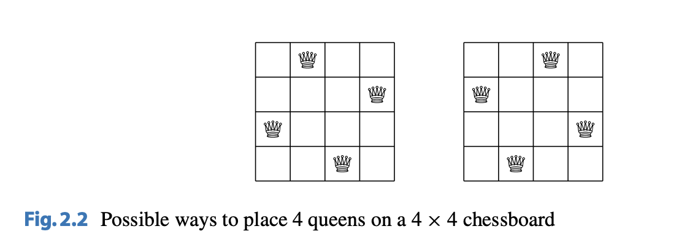
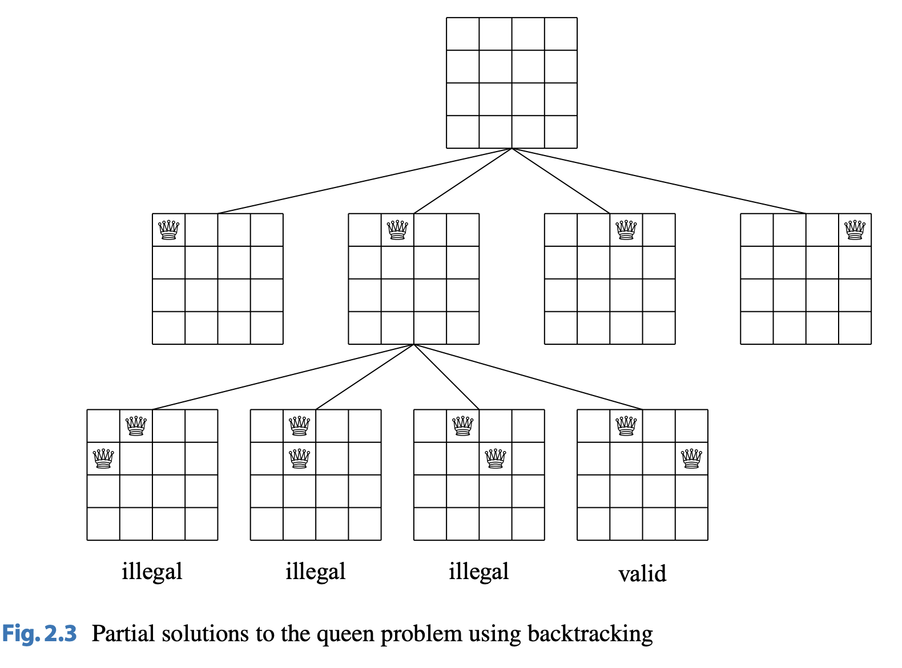

# Backtracking

## About

A backtracking algorithm is an algorithm that begins with an empty solution and extends the solution step-by-step. The search recursively goes through all the different possible ways of how a solution can be constructed.

---

An example of backtracking is the the problem of calculating the number of ways $n$ queens
can be placed on an $n * n$ chessboard so that no two queens attack each other. For
example, Fig. $2.2$ shows the two possible solutions for $n = 4$:

---

The problem can be soled with backtracking by placing the $n$ queens row by row on the $n * n$ chessboard. The idea is that each queen will be on each row so that no queen can attack any other queens placed before.

---

Figure $2.3$ shows some partial solutions generated by backtracking when $n = 4$.

