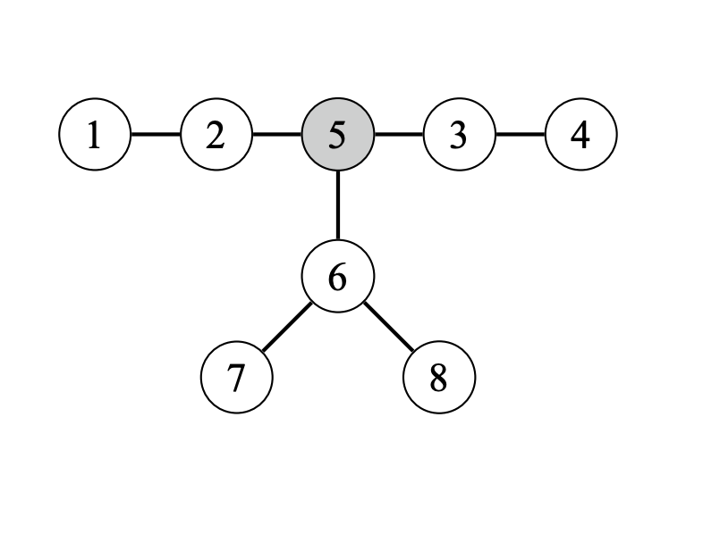

# Advanced Techniques

## Centroid Decomposition

A centroid of a tree of $n$ nodes is a node whose removal divides the tree into subtrees each of which contains at most $\lfloor n / 2 \rfloor$ nodes. For example, node $5$ is the centroid of the following tree:

## Heavy-Light Decomposition

**TODO: Couldn't understand this. Need to read [this blog](https://blog.anudeep2011.com/heavy-light-decomposition/) and other resources to understand.**
