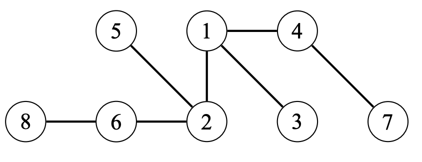

# Trees

## About

A tree is a connected acyclic (no cycles) graph with $n$ nodes and $n - 1$ edges. Removing any edge from the tree divides it into two components, and adding any edge creates a cycle. There is **always** a unique path between any two nodes of a tree. The leaves of the tree are the nodes with only one neighbor. An example of a tree is shown:

## Rooted Trees

In a rooted tree, one of the nodes is the root of the tree, and all other nodes are placed underneath the root. The
