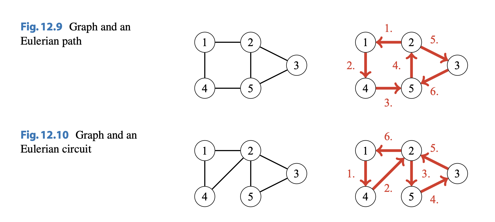
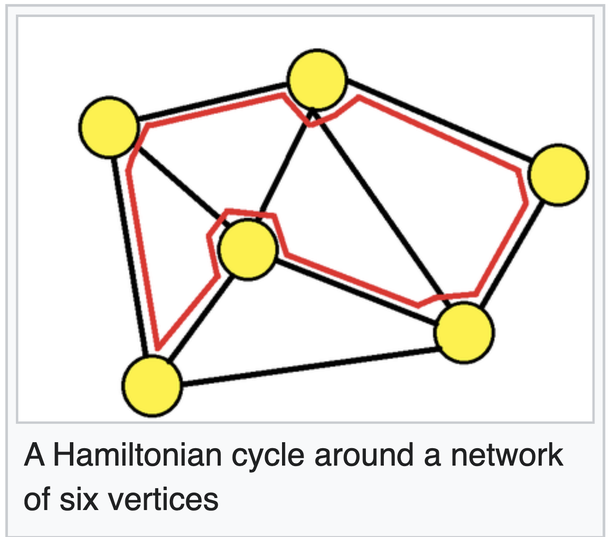
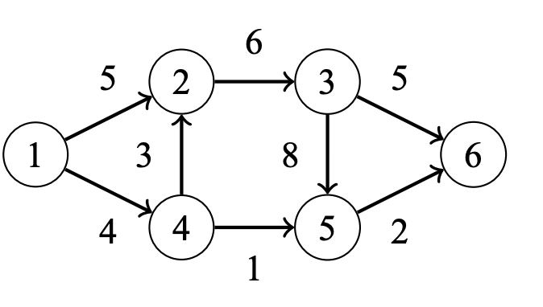

# Complete Paths

## Eulerian Paths

An Eulerian path is a path that goes through each of the graph exactly once.

## Eulerian Circut

An Eulerian circuit is a Eulerian path that starts and ends at the same node.

An example of both of these are shown below:

## Checking a Graph for Eulerian Paths/Circuits

-   Case 1: Graph $G$ is undirected

An undirected graph has an Eulerian path exactly when all the edges belong to
the same connected component and

-   the degree of each node is even, **_or_**
-   the degree of exactly two nodes is odd, and the degree of all other nodes is even.

In the first case, each Eulerian path is also an Eulerian circuit. In the second case, the odd-degree nodes are the endpoints of an Eulerian path which is not an Eulerian circuit.

-   Case 2: Graph $G$ is directed

To determine whether a directed graph has Eulerian paths, we focus on indegrees and outdegrees of the nodes. A directed graph contains an Eulerian path exactly when all the edges belong to the same connected component and

-   in each node, the indegree equals the outdegree, **_or_**
-   in one node, the indegree is one larger than the outdegree, in another node, the outdegree is one larger than the indegree, and in all other nodes, the indegree equals the outdegree.

In the first case, each Eulerian path is also an Eulerian circuit, and in the second
case, the graph has an Eulerian path that begins at the node whose outdegree is larger
and ends at the node whose indegree is larger.

## Hamiltonian Paths

A Hamiltonian Path is a path on a graph $G$ that visits each vertex exactly once.

## Maximum Flow

In the maximum flow problem, we are given a directed weighted graph that contains two special nodes: a source is a node with no incoming edges, and a sink is a node with no outgoing edges. Our task is to send as much flow as possible from the source to the sink. Each edge has a capacity that restricts the flow that can go through the edge, and in each intermediate node, the incoming and outgoing flow has to be equal. For example, here's a graph with source of $1$ and sink $6$:

