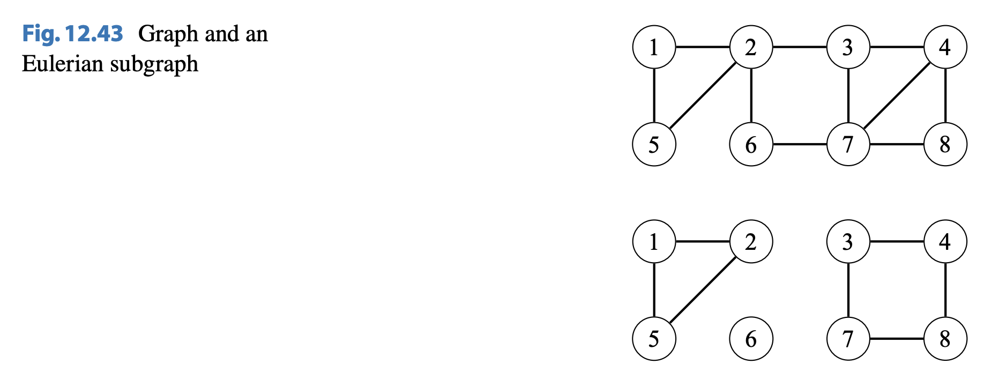

# Depth-First Search Trees

## Articulation Point

A node is called an articulation point if removing the node from the graph disconnects the graph.

## Biconnectivity

A connected graph is called biconnected if it remains connected after removing any single node (and its edges _if applicable_). A biconnected graph does not have an articulation point.

## Eulerian Subgraphs

An Eulerian subgraph of a graph contains the nodes of the graph and a subset of the edges such that the degree of each node is even.

