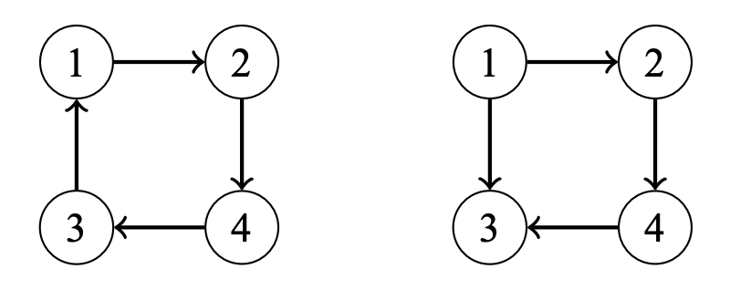
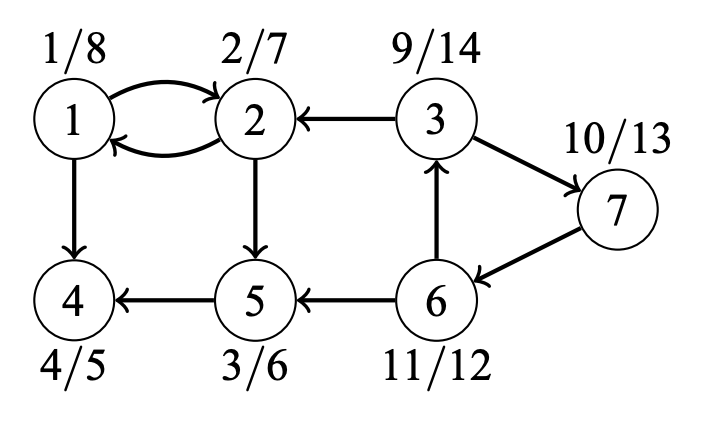
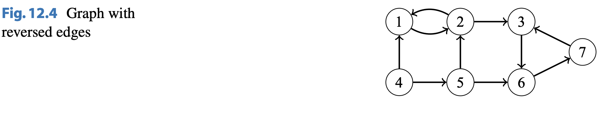

# Strong Connectivity

## About

A directed graph is strongly connected if there is a path from any node to all other nodes in the graph. The graph on the left is strongly connected, while the graph on the right is not strongly connected.

A directed graph can always be divided into strongly connected components.

## Kosaraju's Algorithm

Kosaraju's algorithm is an efficient algorithm for finding the strongly connected components of a graph. The algorithm performs two dept-first searches: the first search constructs a list of nodes according to the structure of the graph, and the second search forms the strongly connected components.

The first phase of the algorithm constructs a list of nodes in the order of which DFS processes them. The algorithm goes through the nodes and begins a DFS at each unprocessed node. Each node is added to the list after being processed. For example, the resulting list for the image below is $\{ 4, 5, 2, 1, 6, 7, 3 \}$.

Note that the $x/y$ notation means that processing the node started at time $x$ and ended at time $y$.

The second phase of Kosaraju's algorithm forms the strongly connected components. First, the algorithm reverses every edge of the graph. This guarantees that during the second search, we will always find the strongly connected components. Our graph with reversed edges is shown:

