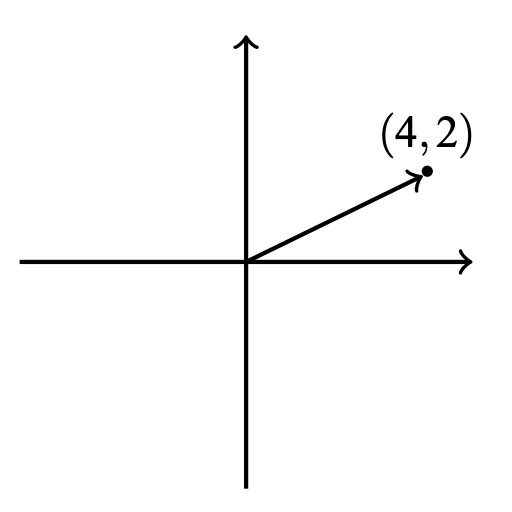
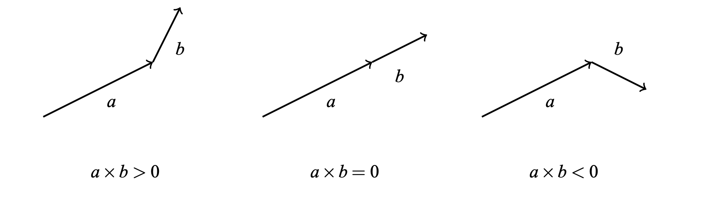

# Techniques

## Complex Numbers

### About

A complex number is a number in the form of $x + yi$ where $i = \sqrt{-1}$ (the imaginary number). For example, $4 + 2i$ is a complex number and we can plot it as shown on a $2D$ coordinate plane:



### C++ Data Type

The C++ complex number class `complex` is useful when solving geometric problems. Using this class, we can represent points and vectors as complex numbers and use the features of the class to manipulate them. To do this, we need to define the coordinate type $C$. Depending on the situation, a suitable type is `long long` or `long double`. After this, we can define a complex type $P$ that represents a point or vector:

```cpp
typedef long long C;
// - or -
typedef long double C;

typedef complex<C> P;
```

Finally, we define the following macros to refer the $x$ and $y$ coordinates:

```cpp
#define X real()
#define Y imag()
```

For example, the following code creates a point $p = (4, 2)$ or $4 + 2i$:

```cpp
P p = {4, 2};
cout << p.X << p.Y << "\n"; // 4 2
```

The following code creates vectors $v = (3, 1)$ and $u = (2, 2)$ and calculates $v + u$:

```cpp
P v = {3, 1};
P u = {2, 2};
P s = v + u;

cout << s.X << s.Y << "\n"; // 5 3
```

## Cross Product

The cross product $a * b$ of vectors $a = (x_1, y_1)$ and $b = (x_2, y_2)$ is defined to be $x_1y_2 - x_2y_1$. There are $3$ cases:

-   $a * b > 0$: $b$ turns left
-   $a * b = 0$: $b$ does not turn (or turns $180$ degrees)
-   $a * b < 0$: $b$ turns right



This can be simply implemented in c++:

```cpp
P a = {4, 2};
P b = {1, 2};

C p = (conj(a) * b).Y; // 6
```

## Testing Point Location

The cross product $(p - s_1) * (p - s_2)$ tells us the location of the point $p$. If the cross product is positive, $p$ is located on the left side. If the cross product is negative, $p$ is on the right side.

## Distance from a Point to a Line

Another property of cross products is that the area of a triangle can be calculated using the formula:

$$\frac{|(a - c) * (b - c)|}{2}$$

where $a$, $b$, and $c$ are the vertices of the triangle.

The shortest distance is:

$$d = \frac{(s_1 - p) * (s_2 - p)}{|s_2 - s_1|}$$

## Pick's Theorem

Pick's theorem provides a way to calculate the area of a polygon, assuming that all vertices of the polygon have integer coordinates.

$$a + \frac{b}{2} - 1$$

where $a$ is the number of integer points inside the polygon and $b$ is the number of integer points on the boundary of the polgyon.

## Euclidean Distance

The distance between points $(x_1, y_1)$ and $(x_2, y_2)$ can be found with the Euclidean distance:

$$\sqrt{(x_2 - x_1)^2 + (y_2 - y_1)^2)}$$

## Manhattan Distance

The distance between points $(x_1, y_1)$ and $(x_2, y_2)$ can also be found with the Manhattan distance:

$$|x_1 - x_2| + |y_1 - y_2|$$
