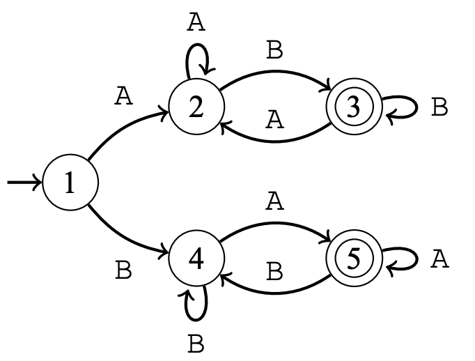

# String Automata

## Automaton

An automaton is a directed graph whose nodes are called states and edges are called transitions. One of the states is a start state, marked with an incoming edge, and there can be any number of accept states, marked with double circles. Each transition is assigned a character.

We can use an automaton to check if a string has a required format. To do that, we begin at the start state and then process the characters from left to right move through the transitions. If the final state after processing the entire string is an accept state, the string is accepted, and otherwise, it is rejected.

In automata theory, any set of strings can be called a language. The language of an automaton consists of all strings it accepts. An automaton recognizes a language if it is able to accept all strings in the language and rejects all other strings.

For example, the following image shows an automaton that accepts all strings that consist of characters $A$ and $b$ whose first and last character are different, i.e., the language of automation is:

$$\{ AB, BA, AAB, ABB, BAA, BBA, ... \}$$

In this automaton, state $1$ is the start state, and states $3$ and $5$ are accept states. When the automaton is given the string $ABB$, it goes through states $1 -> 2 -> 3 -> 3$ and accepts the string. If we are given the string $ABA$, it goes through the states $1 -> 2 -> 3 -> 2$ and rejects the string.

## Regular Languages

A language is called regular if there is an automaton that recognizes it. It turns out that a language is regular exactly when there is a regular expression that describes the required format of the strings in the language. Regular expressions have the following basic building blocks:

- A vertical bar $|$ means that we can choose one of the options. For example $AB|BA|C$ accepts the strings $AB$, $BA$, and $C$.
- Parentheses $($ and $)$ can be used in grouping. For example, the regular expression $A(A | B)C$ accepts the strings $AAC$ and $ABC$.
- An asterik $*$ means that the preceding part can be repeated any number of times (including zero times). For example, the $A(BC)*$ accepts the strings $A$, $ABC$, $ABCBC$, etc.
