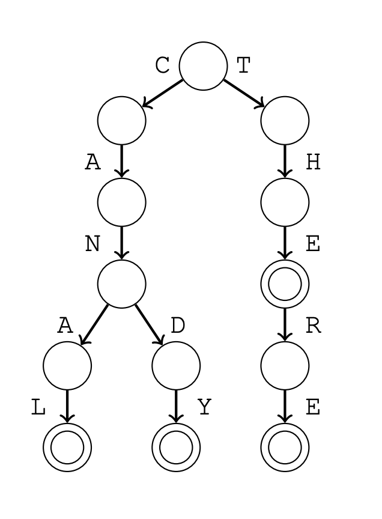

# Trie Structure

## About

A trie is a rooted tree that maintains a set of strings. Each string in the set is tored as a character chain that starts at the root node. If two strings have a common prefix, they also have a common chain in the tree. As an example, the image below contains the set _$\{$CANAL, CANDY, THE, THERE$\}$_. A circle at a node means that a string in the set ends at that node.



After constructing a trie, we can easily check wheter it contains a given string by following the chain that starts at the root node. We can also add a new string to the trie by first following the chain and then adding new nodes if necessary. Both the operations work in $\theta(n)$ time where $n$ is the length of the string.

## Implementation

A tree can be stored as an array:

```cpp
int tree[N][A];
```

where $N$ is the maximum number of nodes and $A$ is the size of the alphabet. Trie nodes are number as $0, 1, 2, ...$ in such a way that the number of the root is $0$ and $trie[s][c]$ specifies the next node in the chain when we move from node $s$ to character $c$.
