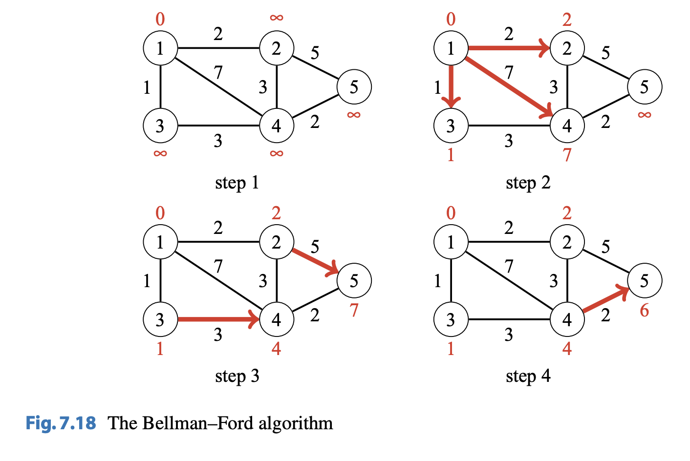
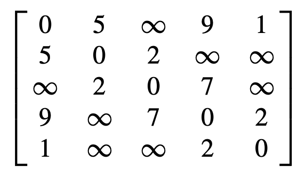

# Shortest Paths

## Bellman-Ford Algorithm

### About

The Bellman-Ford Algorithm finds the shortest path from a starting node to all nodes of a graph. The algorithm can process all graphs, except for graphs does not contain a negative cycle. If it does, the algorithm can detect this.

The algorithm keeps track of distances from the starting node to all nodes of the
graph. Initially, the distance to the starting node is $0$ and the distance to any other node
is $\infty$. The algorithm then reduces the distances by finding edges that shorten
the paths until it is not possible to reduce any distance.

Figure $7.18$ shows how the Bellman–Ford algorithm processes a graph. First, the
algorithm reduces distances using the edges $1 → 2, 1 → 3$ and $1 → 4$, then using
the edges $2 → 5$ and $3 → 4$, and finally using the edge $4 → 5$. After this, no edge
can be used to reduce distances, which means that the distances are final.


Figure $7.18$

### Implementation

```cpp
// Infinity
const INF = 1000001; // 10^6 + 1

// array of n nodes containing distance from node x to node i
vector<int> distance(n + 1);

// Set distance from node x to all the other nodes as infinity
for (int i = 1; i <= n; i++) {
  distance[i] = INF;
}

// Distance from node x to itself is 0
distance[x] = 0;

// Go through each edge of the graph
for (int i = 1; i <= n-1; i++) {
  // Update distance
  for (auto e : edges) {
    int a, b, w;

    // Efficient way to unpack tuples
    // a = e.a
    // b = e.b
    // w = e.w
    tie(a, b, w) = e;

    // Reduce the distance
    distance[b] = min(distance[b], distance[a]+w);
  }
}
```

## Dijkstra's Algorithm

### About

Dijkstra’s algorithm finds shortest paths from the starting node to all nodes of the graph, like the Bellman–Ford algorithm. The benefit of Dijkstra’s algorithm is that it is more efficient and can be used for processing large graphs. However, the algorithm requires that there are no negative weight edges in the graph.

Like the Bellman–Ford algorithm, Dijkstra’s algorithm maintains distances to the nodes and reduces them during the search. At each step, Dijkstra’s algorithm selects a node that has not been processed yet and whose distance is as small as possible. Then, the algorithm goes through all edges that start at the node and reduces the distances using them. Dijkstra’s algorithm is efficient, because it only processes each edge in the graph once, using the fact that there are no negative edges.

Figure $7.20$ shows how Dijkstra’s algorithm processes a graph. Like in the Bellman–Ford algorithm, the initial distance to all nodes, except for the starting node, is infinite. The algorithm processes the nodes in the order $1$, $5$, $4$, $2$, $3$, and at each node reduces distances using edges that start at the node. Note that the distance to a node never changes after processing the node.


### Implementation

An efficient implementation of Dijkstra's algorithm requries that we can efficiently find the minimum distance node that has not been processed. An appropriate data structure for this is the priority queue. With a priority queue, we can retrieve items in logarithmic time.

A typical textbook implementation of Dijkstra’s algorithm uses a priority queue that has an operation for modifying a value in the queue. This allows us to have
a single instance of each node in the queue and update its distance when needed. However, standard library priority queues do not provide such an operation, and a somewhat different implementation is usually used in competitive programming. The idea is to add a new instance of a node to the priority queue always when its distance changes. Our implementation of Dijkstra’s algorithm calculates the minimum distances
from a node $x$ to all other nodes of the graph. The graph is stored as adjacency lists
so that $adj[a]$ contains a pair $(b,w)$ always when there is an edge from node $a$ to
node $b$ with weight $w$. The priority queue contains pairs of the form $(−d, x)$, meaning that the current distance to node $x$ is $d$. The array distance contains the distance to each node, and the array processed indicates whether a node has been processed. Note that the priority queue contains negative distances to nodes. The reason for this is that the default version of the C++ priority queue finds maximum elements, while we want to find minimum elements. By exploiting negative distances, we can directly use the default priority queue. Also note that while there may be several instances of a node in the priority queue, only the instance with the minimum distance will be processed.

The implementation is as follows:

```cpp
priority_queue<pair<int,int>> q;

for (int i = 1; i <= n; i++) {
  distance[i] = INF;
}

distance[x] = 0;
q.push({0,x});

while (!q.empty()) {
  int a = q.top().second; q.pop();

  if (processed[a]) continue;

  processed[a] = true;

  for (auto u : adj[a]) {
    int b = u.first,w = u.second;

    if (distance[a] + w < distance[b]) {
      distance[b] = distance[a]+w;
      q.push({-distance[b],b});
    }
  }
}
```

## Floyd-Warshall Algorithm

### About

The Floyd-Warshall algorithm starts off with an adjacency matrix $dist$ where $dist[a][b]$ represents the distance from node $a$ to node $b$. Unlike other algorithms, the Floyd-Warshall algorithm

### Example

Suppose we have an adjacency matrix $dist$:



In the first round of
