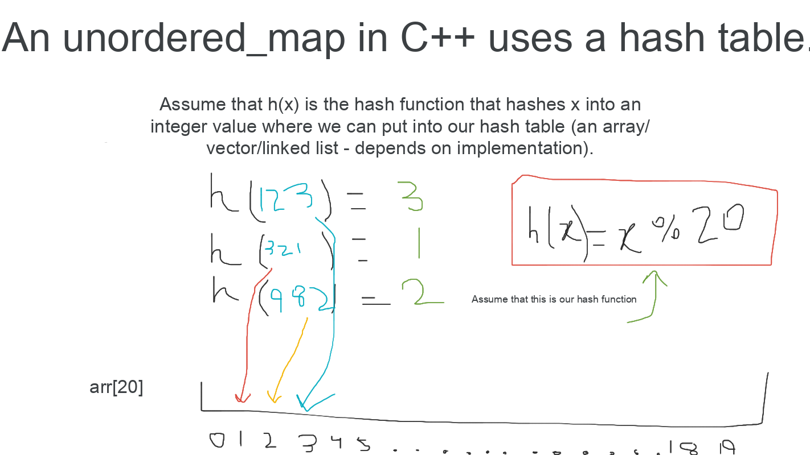

# Unordered Map

## Contents

-   [Map](map.md)
-   [Unordered map](#)
-   [Multimap](multimap.md)

---

<details>

<summary>Why Unordered Map?</summary>

Unlike a [`map`](map.md), an `unordered_map` in C++ uses a hash table and **the order in which the $(key, value)$ pairs are stored is random**.



**WARNING: An `unordered_map` can only store $key$ data types that are [hashable - click to see hashable data types](http://www.cplusplus.com/reference/functional/hash/) (provided by C++ STL). If the data type for $key$ is not supported (eg. `pair`), we must create our own hash function.**

</details>


<details>

<summary>Creating our Own Hash Function</summary>

```cpp
unordered_map<pair<int, int>, int> mp;
```

You will get Compilation Error! Why? See [this page](http://www.cplusplus.com/reference/functional/hash) for `unordered_map` supported types. For unsupported types, you have to create your own hash function for use. For example, let's see how we can create a hash function for `pair<int, int>`.

As you know, any `int` value is between $-2^{31}+1$ to $2^{31}-1$. So, if we create a hash function that for every `pair<int, int>` returns distinct values in type `size_t` (alias of `unsigned int`), it will be done. It is pretty easy: `x.first^(x.second<<32)` is good. But be careful about overflow. For having a good hash function, we use `hash<long long>`. The code looks like this:

```cpp
struct HASH {
  size_t operator()(const pair<int,int>&x)const{
    return hash<long long>()(((long long)x.first)^(((long long)x.second)<<32));
  }
};
unordered_map<pair<int, int>, int, HASH> mp;
```

Now you have a unordered_map of `pair<int, int>` (it doesn't matter what the value is - only the key matters). Creating hash function for other unsupported data types is same.

</details>

<details>

<summary>A Faster Hash Function for Unordered Map</summary>

A faster hash function for unordered map that works only on integers:

```cpp
struct custom_hash {
    static uint64_t splitmix64(uint64_t x) {
        // http://xorshift.di.unimi.it/splitmix64.c
        x += 0x9e3779b97f4a7c15;
        x = (x ^ (x >> 30)) * 0xbf58476d1ce4e5b9;
        x = (x ^ (x >> 27)) * 0x94d049bb133111eb;
        return x ^ (x >> 31);
    }

    size_t operator()(uint64_t x) const {
        static const uint64_t FIXED_RANDOM = chrono::steady_clock::now().time_since_epoch().count();
        return splitmix64(x + FIXED_RANDOM);
    }
};
```

([Source: Neal Wu's Blog](https://codeforces.com/blog/entry/62393))

</details>

<details>

<summary><code>map</code> vs. <code>unordered_map</code></summary>

-   `unordered_map` is 4 times faster than `map`.
-   `map` is sorted, while `unordered_map` is not. Also, there isn't a `lower_bound`/`upper_bound` function in `unordered_map`, while `map` does.

</details>

<details>

<summary>Unordered Map Usage</summary>

The following code creates a unordered map where the keys are strings and the values are integers:

```cpp
unordered_map<string,int> m;
m["monkey"] = 4;
m["banana"] = 3;
m["harpsichord"] = 9;
cout << m["banana"] << "\n"; // 3
```

If the value of a key is requested but the key doesn't exist, the key is automatically added to the unordered map with a value of $0$.

```cpp
unordered_map<string,int> m;
cout << m["random"] << "\n"; // 0
```

Also, the `count` function can be used to check if the key exists.

**NOTE: The `count` function doesn't "count" how many times a key appears in the unordered map. It returns $1$ if the key is present in the unordered map, and $0$ if the key is not.**

```cpp
unordered_map<string, int> m;

if (m.count("random")) {
  // key exists
} else {
  // key doesn't exist
}
```

To print a unordered map in C++, refer to the following code:

```cpp
unordered_map<string, int> m;

for (auto i : m) {
  cout << i.first << " " << i.second << "\n";
}
```

</details>

<details>

<summary>Iterators in a Unordered Map</summary>

Unlike vectors, using iterators with a unordered map is the same as a linked list. We cannot directly do `map.begin() + 2`/`map.end() - 2`/`map.begin() * 2`. We also cannot subtract/add iterators from an iterator. Instead, we have to do the following:

```cpp
unordered_map<int> map1;
// -- adding data to the unordered map is omitted for brevity

auto it = map1.begin();
it++; // move 1 space foward

// move 4 spaces forward
for (int i = 1; i <= 4; i++)
  it++;

// == OR ==
advance(it, 2); // move ahead 2 spaces forward
```

</details>

<details>

<summary>Time Complexity of Operations</summary>

| Operation      | Average Case | Worst Case  |
| -------------- | ------------ | ----------- |
| `map[x]`       | $\theta(1)$  | $\theta(n)$ |
| `map.count()`  | $\theta(1)$  | $\theta(n)$ |
| `map.find()`   | $\theta(1)$  | $\theta(n)$ |
| `map.erase()`  | $\theta(1)$  | $\theta(n)$ |
| `map.insert()` | $\theta(1)$  | $\theta(n)$ |
| `map.size()`   | $\theta(1)$  | $\theta(1)$ |
| `map.empty()`  | $\theta(1)$  | $\theta(1)$ |

</details>
