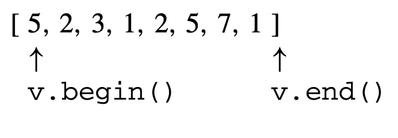

# Vectors

## About

A `vector` is a dynamic array.

## Syntax

---

**NOTE: Assume that $n$ is the size of the array.**

---

### Creating a Static Vector

```cpp
vector<int> arr(50);
```

In the example above, we're creating a vector of size $50$ (we can store $50$ elements from indexes $0$ to $49$).

If we were to access the $6$-th element, we can access it with $arr[6]$.

**WARNING: The $i$-th index in $arr[i]$ must be an integer from $0$ to $n - 1$ where $n$ is the size of the vector.**

To add/update the data at $arr[i]$, we can use the following format:

```cpp
arr[6] = 3;
arr[4] = 9;

arr[6] = 2; // update the data at arr[6]
```

---

### Creating a Dynamic Vector

Also, we can create an vector through the following format:

```cpp
vector<int> arr;
```

And add elements with the `push_back` function:

```cpp
arr.push_back(50);
arr.push_back(32);
```

**WARNING: Using the example above, we can't access/update the element at $arr[6]$. We can only access elements in the array boundaries ($0$ to $n -  1$).**

---

### Vectors with Different Data Types

For general cases, defining a vector follows the following format:

```cpp
vector<data_type_here> your_name_here;
```

where $data\_type\_here$ is the data type you want the vector to store and $your\_name\_here$ is the name of the array.

We can also define the following vectors (and more) without any issues:

```cpp
vector<int> ints;
vector<string> str;
vector<float> floats;
vector<double> doubles;
vector<long long> ll;
vector<char> c;
```

We can even define a vector with a vector inside!

```cpp
// 2D vectors:
vector<vector<int>> ints_2d;
vector<vector<string>> str_2d;
vector<vector<float>> floats_2d;
vector<vector<double>> doubles_2d;
vector<vector<long long>> ll_2d;
vector<vector<char>> c_2d;

// Adding values
// Add a vector that contains 2 to the 2D vector 'ints_2d'
ints_2d.push_back({2});

// Accessing data in arr[row][column] format
cout << ints_2d[0][0] << "\n"; // 2

// Updating data in arr[row][column] format
ints_2d[0][0] = 3;
ints_2d[0][0]++;

// Accessing data in arr[row][column] format
cout << ints_2d[0][0] << "\n"; // 4
```

**WARNING: When defining vectors, make sure your array names are different!**

---

### Defining Vectors with Data (Part 1)

We can define a vector with some starting data using the format shown below:

```cpp
vector<int> arr1 = {4, 5, 6};
// Our vector now contains {4, 5, 6}.

// -- OR --
// in C++ 11 and above:
vector<int> arr2 {4, 5, 6};
// Our vector now contains {4, 5, 6}.
```

---

### Defining Vectors with Data (Part 2)

We can use the `push_back` function to add data to our vector:

```cpp
vector<int> arr;
arr.push_back(1);
// array contains {1}

for (int i = 2; i <= 4; i++)
  arr.push_back(i);

// array contains {1, 2, 3, 4}
```

---

### Removing The Last Element from a Vector

Assume that we have an array $arr$ with elements $\{ 1, 2, 3, 4, 5, 6 \}$. We can delete the last element from the array through the `pop_back` function.

```cpp
arr.pop_back();
```

Now, our array contains $\{ 1, 2, 3, 4, 5 \}$ after deleting the last element.

---

## Size of a Vector

If we were to have an array $arr = \{ 1, 2, 3, 4, 5, 6\}$, and we want to get the `size` of the array, we can use the `size` function:

```cpp
vector<int> arr { 1, 2, 3, 4, 5, 6};

cout << arr.size() << "\n"; // 6
```

---

## Clearing a Vector

If we had a really messy vector, we can clear our vector using the `clear` function:

```cpp
vector<int> arr {1, 2, 3};
cout << arr.size() << "\n"; // 3

arr.clear(); // clear the array

cout << arr.size() << "\n"; // 0
```

---

## Checking if an Vector is Empty

We can check if our vector is empty using the `empty` function (that returns a boolean value):

```cpp
vector<int> arr {1, 2, 3};

// Array is not empty
if (arr.empty())
  cout << "Array is empty\n";
else
  cout << "Array is not empty\n";

arr.clear(); // clear the array

// Array is empty
if (arr.empty())
  cout << "Array is empty\n";
else
  cout << "Array is not empty\n";
```

---

## Time Complexities of Vector Operations

Here are the most important functions used in CP and their time complexities:

\*_Table ordered from most important to least important._

| Operation   | Time Complexity                                                 |
| ----------- | --------------------------------------------------------------- |
| `push_back` | $\theta(1)$                                                     |
| `pop_back`  | $\theta(1)$                                                     |
| `size`      | $\theta(1)$                                                     |
| `clear`     | depending on your machine, it may be $\theta(1)$ or $\theta(n)$ |
| `empty`     | $\theta(1)$                                                     |
| `insert`    | $\theta(n)$                                                     |

---

## `push_back` vs. `emplace_back`

#### **[Source](https://qr.ae/pN0zCj)**

Here are the steps to execute `push_back`:

1. construct a new (empty) element
2. add it to the end of the container
3. copy the argument into the new element in #1

While the steps to execute `emplace_back`:

1. construct a new element using the argument values
2. add it to the end of the container

Using `emplace_back` spares you a copy operation.

---

## Iterators



Note that `begin()` points to an element in the data structure (first element), while `end()` points outside the data structure (last element outside the data structure + 1). The element where an iterator points to can be accessed using the $*$ symbol.

```cpp
cout << *arr.begin() << "\n";
```

---

## Special Operations

Some of the operations possible such that we have an `vector` called $arr$:

-   `arr.back()`: returns last element of a vector
-   `arr.pop_back()`: Deletes the last element of a vector
-   `arr.begin()`: Iterator to first element in array
-   `arr.end()`: Iterator to end of the array + 1
-   `std::shuffle(arr.begin(), arr.end())`: Randomly shuffles the array
-   `arr.erase(std::unique(arr.begin(), arr.end()))`: Makes the array unique
-   `std::sort(arr.begin(), arr.end())`: Sorts the array
