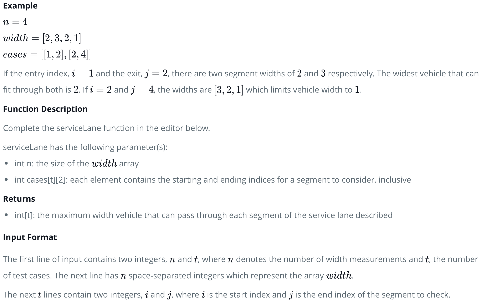

# Sparse Table [C++ Code](./sparse-table.cpp)

## About

Sparse Table is a data structure, that allows answering range queries. It can answer most range queries in $\theta(log \ n)$, but its true power is answering range minimum queries (or equivalent range maximum queries). For those queries it can compute the answer in $\theta(1)$ time.

**The only drawback of this data structure is, that it can only be used on immutable arrays.** This means, that the array cannot be changed between two queries. If any element in the array changes, the complete data structure has to be recomputed.

Any non-negative number can be uniquely represented as a sum of decreasing powers of two. This is just a variant of the binary representation of a number. E.g. $13=(1101)_2=8+4+1$. For a number $x$ there can be at most $ceil(log_2x)$ summands.

By the same reasoning any interval can be uniquely represented as a union of intervals with lengths that are decreasing powers of two. E.g. $[2,14]=[2,9] \cup [10,13] \cup [14,14]$, where the complete interval has length $13$, and the individual intervals have the lengths $8$, $4$ and $1$ respectably. And also here the union consists of at most $ceil(log_2(\text{length of interval}))$ many intervals.

The main idea behind Sparse Tables is to precompute all answers for range queries with power of two length. Afterwards, a different range query can be answered by splitting the range into ranges with power of two lengths, looking up the precomputed answers, and combining them to receive a complete answer.

## Example Problem: Range Minimum Query ([View Problem on HackerRank OJ](https://www.hackerrank.com/challenges/service-lane/problem))





#### **Note: This problem is the same as [`RMQSQ` on SPOJ](https://www.spoj.com/problems/RMQSQ/).**

### Preprocessing

For every possible query range $[L, R]$, we store ranges that are in powers of $2$. Let $min[i][j]$ be the minimum value for the range $[i, i + 2^j - 1]$ (range indexes is inclusive) of length $2^j$. The size of the array $min$ is $n * k$, where $k = ceil(log_2(n))$. $k$ will be the biggest power of $2$ range we have to support. For arrays of length $\leq 10^7$ elements, $k = 25$ is a good value.

For every $i$ where $i < n$, $min[i][0] = arr[i]$, according to the $min[i][j]$ defintion explained above. Otherwise $min[i][j] = min(\text{0 to k}, \text{k to } i + 2^j - 1)$. For example, to find the minimum of the range $[0, 7]$, we use the minimum of $[0, 3]$ and $[4, 7]$.

**NOTE: For $\theta(1)$ queries, we'll also compute the logarithms from $1$ to $n$, stored in the logarithm array $log$.**

### Query

For each query, we find the highest power of $2$ that is $\leq$ the # of elements in the given range ($b - a + 1$). Then, we take the minimum of $a + \text{(closest-power-of-2)}$ and $b - \text{(closest-power-of-2)} + 1$

**NOTE: In the implementation, $(1 << j)$ is $2^j$ - see [here](https://www.youtube.com/watch?v=PGSb-hYfLMc)**.

### Time Complexity

Using this approach, preprocessing takes $\theta(n \ log \ n)$ and queries are $\theta(1)$, with $\theta(n \ log \ n)$ space used.

## A Template For All Sparse Table Problems

```cpp
int st[n][k + 1];
```

Because the range $[i, i + 2^j - 1]$ of length $2^j$ splits nicely into the ranges $[i, i + 2^{j - 1} - 1]$ and $[i + 2^{j - 1}, i + 2^j - 1]$, both of length $2^{j - 1}$, we can generate the table efficiently using dynamic programming:

```cpp
int f(int a, int b) {
  return min(a, b); // <-- change this depending on problem
}

int k = ceil(log2(n));

for (int i = 0; i < n; i++)
    st[i][0] = f(array[i]); // <-- change this depending on problem

for (int j = 1; j <= k; j++)
    for (int i = 0; i + (1 << j) <= n; i++)
        st[i][j] = f(st[i][j-1], st[i + (1 << (j - 1))][j - 1]);

// Depending on the problem, the way we answer queries is different.
```

The function $f$ will depend on the type of query. For range sum queries it will compute the sum, for range minimum queries it will compute the minimum.

The time complexity of the precomputation is $\theta(n \ log \ n)$. Depending on the problem, the time complexity of answering queries if $\theta(log \ n)$ or $\theta(1)$.
