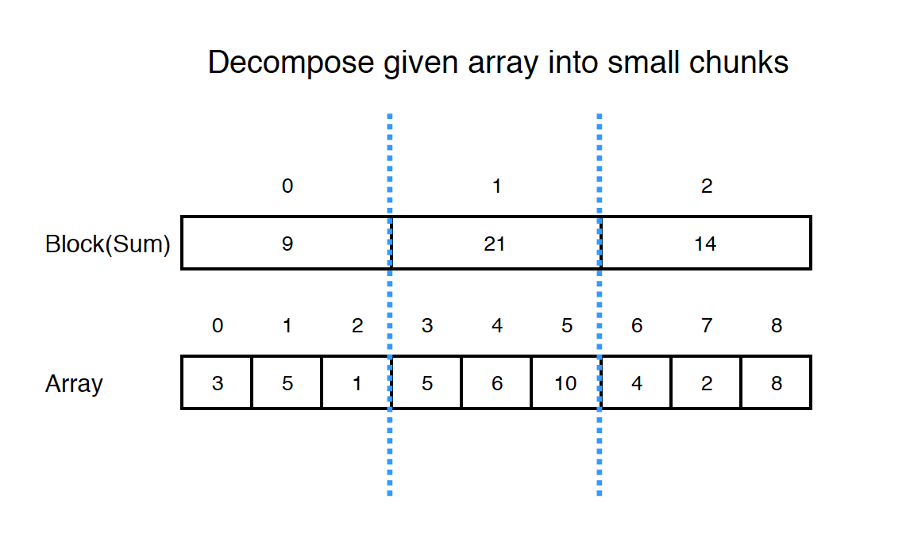
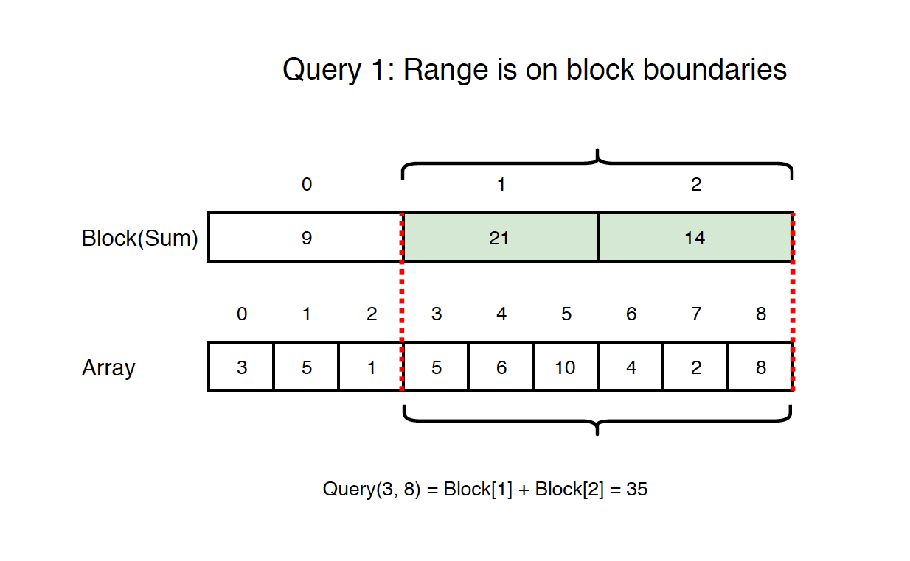
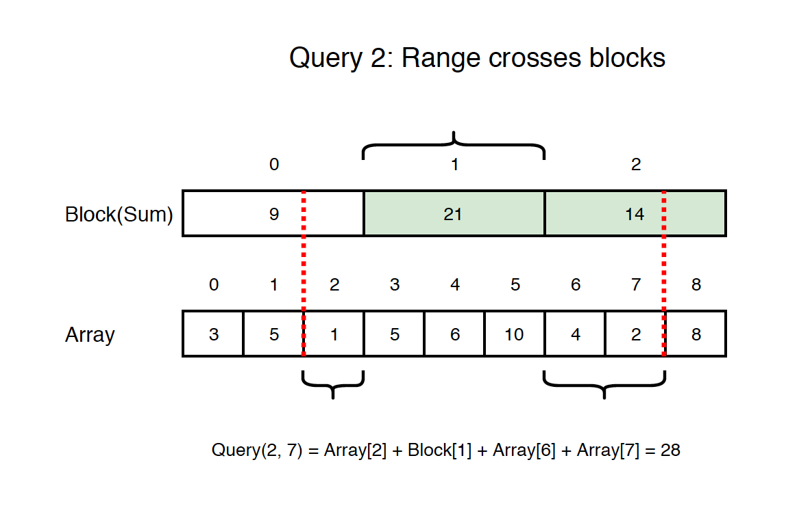
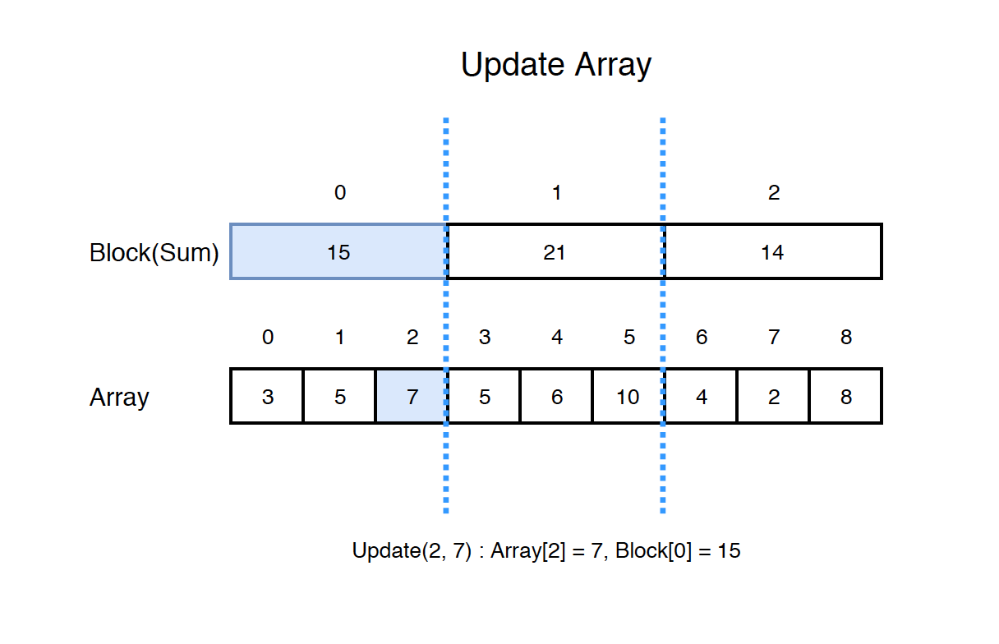

# Sqrt Decomposition

## About

Given an integer array $arr$ with $n$ elements, find the sum of some elements in the range from $i$ to $j$. This array is mutable, meaning, any element in the array can be modified. So, we have two following operations: `query` and `update`. The `query` method should always work even if the array is updated.

-   $query(i, j)$ - Find the sum of the elements between indices $i$ and $j$ ($i \leq j$), inclusive.
-   $update(i, val)$ - Modify the array by updating the element at index $i$ to $val$.

Sqrt Decomposition allows us to answer queries in $\theta(\sqrt{n})$, and the implementation is easier than a Segment Tree or Fenwick Tree.

**[Video Explanation](https://www.youtube.com/watch?v=gWbDocYhwDA)**

## What problems can it be solved?

Sqrt decomposition can be applied in a similar way to a whole class of other problems

- finding the sum of elements of a continuous subarray
- finding min/max element of a subarray
- finding the number of zero elements
- finding the first non-zero element
- counting elements which satisfy a certain property

### allow to update individual array elements

 If an element **arr[i]** changes, it's sufficient to update the value of **b[k]** for the block to which this element belongs **(k = i / blockSize)** in one operation:

`b[k] += arrNew[i] − arrOld[i]`

In finding min/max element of a subarray case, If this problem has to address individual elements' updates as well, updating the value of **b[k]** is also possible, but it will require iterating through all values of block k in **O(blockSize) = O($\sqrt{n}$)** operations.

### maintaining a set of numbers which would allow adding/deleting numbers, checking whether a number belongs to the set and finding k-th largest number.

To solve it one has to store numbers in increasing order, split into several blocks with *$\sqrt{n}$)* numbers in each. Every time a number is added/deleted, the blocks have to be rebalanced by moving numbers between beginnings and ends of adjacent blocks.

### update an array elements on intervals

increment existing elements or replace them with a given value.

For example, let's say we can do two types of operations on an array: add a given value **X** to all array elements on interval *[l, r]* or query the value of element *arr[i]*. Let's store the value which has to be added to all elements of block *k* in *b[k]* (initially all *b[k]=0*). During each "add" operation we need to add **X** to *b[k]* for all blocks which belong to interval [*[l, r]* and to add **X** to *arr[i]* for all elements which belong to the "tails" of the interval. The answer a query *i* is simply *a[i] + b[i/s]*. This way "add" operation has *O($\sqrt{n}$)* complexity, and answering a query has *O(1)* complexity.

## Combined problems

Two classes of problems can be combined if the task requires doing both element updates on an interval and queries on an interval. Both operations can be done with *O($\sqrt{n}$)* complexity. This will require two block arrays *b* and *c*: one to keep track of element updates and another to keep track of answers to the query.

## Preprocess

We "decompose" the array into $\sqrt{n}$ blocks, where each block is of size $\sqrt{n}$ (hence the name Sqrt Decomposition).

If the length of array $n$ is not a perfect square, we'll create $\lceil \sqrt{n} \ \rceil$ blocks, with the remaining unused elements filled with $0$.

The preprocess operation takes $\theta(n)$ time.

## Query

There are two cases for the query.

If the range is on block boundaries, we can get the sum from blocks directly. For example, if the range is from $3$ to $8$, then $block[1]$ and $block[2]$ perfectly cover this range.

If range crosses blocks partially, we cannot get the sum from blocks directly. For example, if the range is from $2$ to $7$, we can get the sum for array $[3, 4, 5]$ from $block[1]$, however, we have to get other sums from the array.

The query time is $\theta(\sqrt{n})$.

## Update

If we update the array, we need to update the block accordingly. For example, $update(2,7)$ will modify the $array[2]$ from $1$ to $7$, and update $block[0]$ from $9$ to $15$.

The update operation takes $\theta(1)$ time.

## Why Sqrt Decomposition?

Sqrt decomposition can solve a wider range of problems than Segment Trees and Fenwick Trees. The low constant factor of operations and easy coding are also reasons it could be used over segment trees when feasible.

## Mo's algorithm

Based on sqrt decomposition, can be used to answer range queries (Q) **offline** in *O((N+Q)$\sqrt{n}$)*

This might sound like a lot worse than the methods in the previous section, since this is a slightly worse complexity than we had earlier and cannot update values between two queries. But in a lot of situations this method has advantages.

During a normal sqrt decomposition, we have to precompute the answers for each block, and merge them during answering queries. In some problems this merging step can be quite problematic.

E.g. when each queries asks to find the **mode** of its range (the number that appears the most often). For this each block would have to store the count of each number in it in some sort of data structure, and we cannot longer perform the merge step fast enough any more.

**Mo's algorithm** uses a completely different approach, that can answer these kind of queries fast, because it only keeps track of one data structure, and the only operations with it are easy and fast.

**[Video Explanation](https://youtu.be/7undZLA3_rU)**
