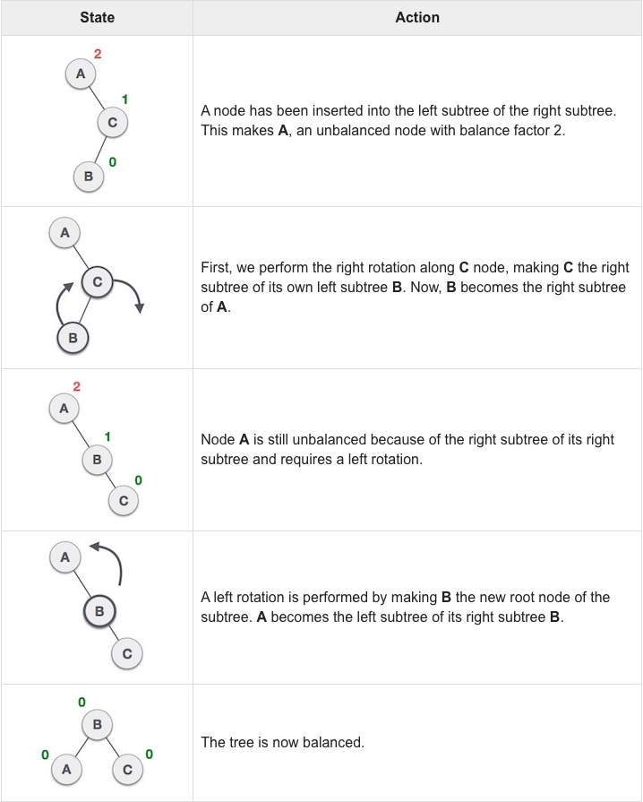
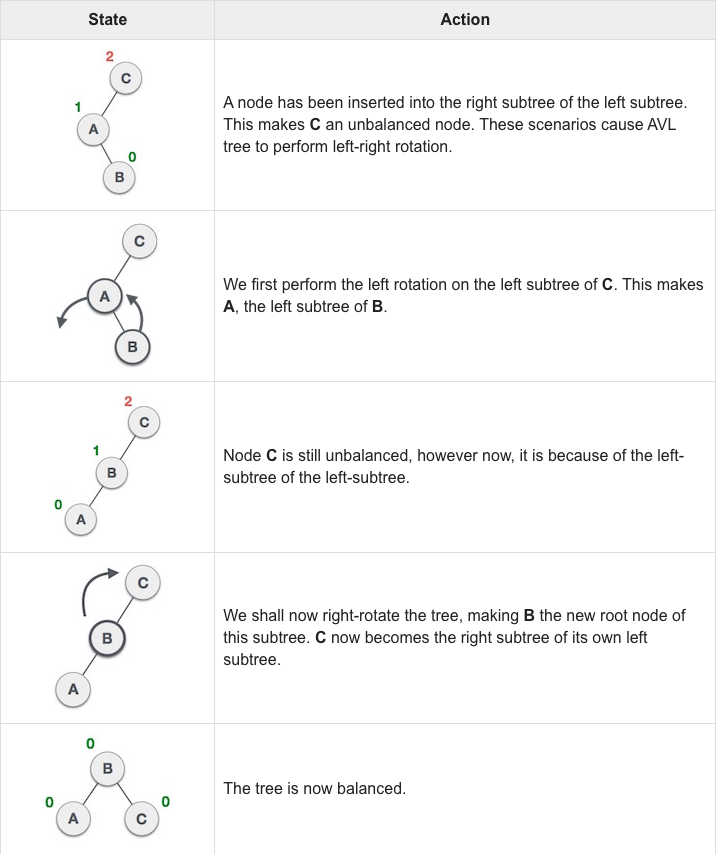

# AVL Tree

> Named after inventors Adelson-Velsky and Landis.

## About

[AVL tree](https://en.wikipedia.org/wiki/AVL_tree) is a height-balancing binary search tree. It checks the height of the left and the right sub-trees and assures that the difference is not more than *1*. This difference is called the Balance Factor.

All balanced binary search tree are binary search tree so the BST invariant (property or rule) holds. This means that for every node *n*, *n.left < n* and *n < n.right*.

BST invariant: BST property or rule.
It does not matter what the structure of the tree looks, all we care about is that the BST invarinat holds.
We can shuffle, transform, rotate the values and nodes in the tree as long as the BST invariant remains satfisfied.

An AVL tree is the simplest self-balancing [Binary Search Tree (BST)](../binary-search-tree/README.md). In an AVL tree, the heights of the two child subtrees of any node differ by at most *1*; if at any time they differ by more than *1*, rebalancing is done to restore this property. Lookup, insertion, and deletion all take O(log n) time in both the average and worst cases, where n is the number of nodes in the tree prior to the operation. Insertions and deletions may require the tree to be rebalanced by one or more tree rotations.


In the second tree, the left subtree of *C* has height *2* and the right subtree has height *0*, so the difference is **2**.
In the third tree, the right subtree of *A* has height *2* and the left is missing, so it is *0*, and the difference is **2** again.
**AVL tree permits difference (balance factor) to be only 1**


## Balance

[Balanced binary search tree rotations Video](https://www.youtube.com/watch?v=q4fnJZr8ztY)

A BST invariant (property or rule) must meet after every operation. To ensure that the tree invariant is always satisfied a series of tree
rotations are normally applied.

The threshold of the binary search tree is *<= 1*

Balance Factor (of Current Node) = Height(Left-Subtree) - Height(Right-Subtree)
AVL Tree = abs(Balance Factor) <= 1
If the difference in the height of left and right sub-trees is more than 1, the tree is balanced using some rotation techniques.

H is for Height:
H(EmptyTree) = -1  (Null)
H(SingleNode) = 0
H(CurrentNode) = max(H(TreeLeft), H(TreeRight) ) + 1

## 4 kinds of Rotations

Rotation should only focus on two nodes, always using rotation to maintain the balance of binary search tree.

*Left-Heavy*: Right, left-right
*Right-Heavy*: Left, right-left.

1. *Left-Heavy*: Right Rotation

```
  1                             2
    \        Focus (2 & 1)    /   \
      2       --------->     1     3
       \
        3
```


2. *Left-Heavy*: left-right (left rotation, then right rotation)

```
  1                           1                              2
    \      Focus (2 & 3)        \         Focus (2 & 1)    /   \
      3      --------->           2       --------->      1     3
    /                               \
  2                                   3
```



3. *Right-Heavy*: Left Rotation


```
        1                        2
      /       Focus (2 & 1)    /   \
    2          --------->     1     3
  /
3
```


4. *Right-Heavy*: right-left (right rotation, then left rotation)

```
    1                          1                         2
   /   Focus (2 & 3)          /       Focus (2 & 1)    /   \
  2     --------->          2          --------->     1     3
    \                     /
      3                  3
```




### Debugging

If run into any bug or issue, you should write a validation function to check the entire tree, to make sure the tree property (node) value in the current state is still an valid binary search tree.
