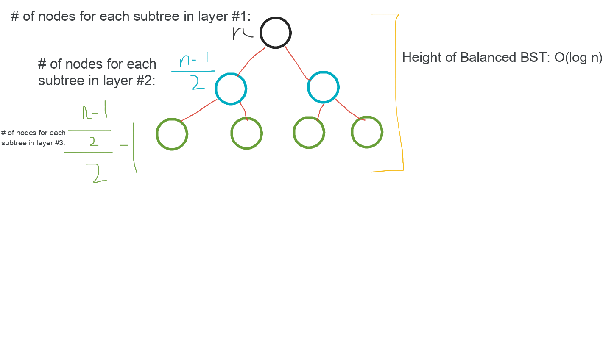

# Binary Search Tree

## Background

A binary search tree is a [binary tree](../binary-tree/README.md) where nodes are always ordered by a properties as shown:

-   left nodes are smaller than the current node
-   right nodes are larger than the current node

The in-order traversal of a BST is the sorted order of the BST.


([Source](https://www.interviewcake.com/concept/cpp/binary-search-tree))

**NOTE: Checking if a [binary tree](../binary-tree/README.md) is a Binary Search Tree is a common question.**

## Pros & Cons of Binary Search Tree

-   Pros:

    -   Good performance:
        -   All operations: $\theta(log \ n)$ time for insert, delete, search
        -   Better worst case performance than hash map

-   Cons:
    -   No constant time operations for insert, delete, search
    -   $\theta(n)$ worst case time if unbalanced for insert, delete, search - This problem is fixed using a self-balanced BST (see [AVL Tree](../avl-tree/README.md)).

## Balanced vs. Un-balanced BSTs

A balanced binary search tree follows the BST properties along with additional properties:

-   Each node has at most $2$ children
-   The difference between the heights of the left subtree and right subtree cannot be more than $1$
-   Accessing any random element should not take more than $\theta(log \ n)$ time
-   If we have $n$ nodes in the tree, the height should be no more than $ceil(log \ n)$ where $ceil$ rounds $log \ n$ up (if necessary).


([Source](https://www.interviewcake.com/concept/cpp/binary-search-tree))

> [AVL Tree](../avl-tree/README.md) is a self-balanced BST.

Also, we can determine the # of nodes for each subtree given the number of nodes in the tree ($n$):



## Insertion in a BST

We check that the BST is not empty. If the BST is empty, we simply add the node with value $x$. Then, if $x < root.val$, we perform $root.left = insert(root.left, x)$. Otherwise, we perform $root.right = insert(root.right, x)$.

**NOTE: For a BST supporting duplicates, we only add the node $x$ if the value doesn't exist. If $x$ exists, we update $x$'s count.**

## Searching in a BST

We check that the BST is not empty. If the BST is not empty, we check that the current value is not equal to the target value $x$. Then, if $x < root.val$, we check if $x$ is in the left subtree. Otherwise, we check if $x$ is in the right subtree.

**NOTE: For a BST supporting duplicates, the # of times the value $x$ exists in the BST should be printed.**

## Deleting from a BST

1. Node to be deleted is the leaf: Simply remove from the tree.

```
              50                            50
           /     \         delete(20)      /   \
          30      70       --------->    30     70
         /  \    /  \                     \    /  \
       20   40  60   80                   40  60   80
```

2. Node to be deleted has only one child: Copy the child to the node and delete the child

```
              50                            50
           /     \         delete(30)      /   \
          30      70       --------->    40     70
            \    /  \                          /  \
            40  60   80                       60   80
```

3. Node to be deleted has two children: Find inorder successor (minimum element on the right) of the node. Copy contents of the inorder successor to the node and delete the inorder successor. Note that inorder predecessor can also be used.

```
              50                            60
           /     \         delete(50)      /   \
          40      70       --------->    40    70
                 /  \                            \
                60   80                           80
```

**NOTE: For a BST supporting duplicates, we only remove the node of the node's count is equal to $1$. Otherwise, we only decrease the count.**
