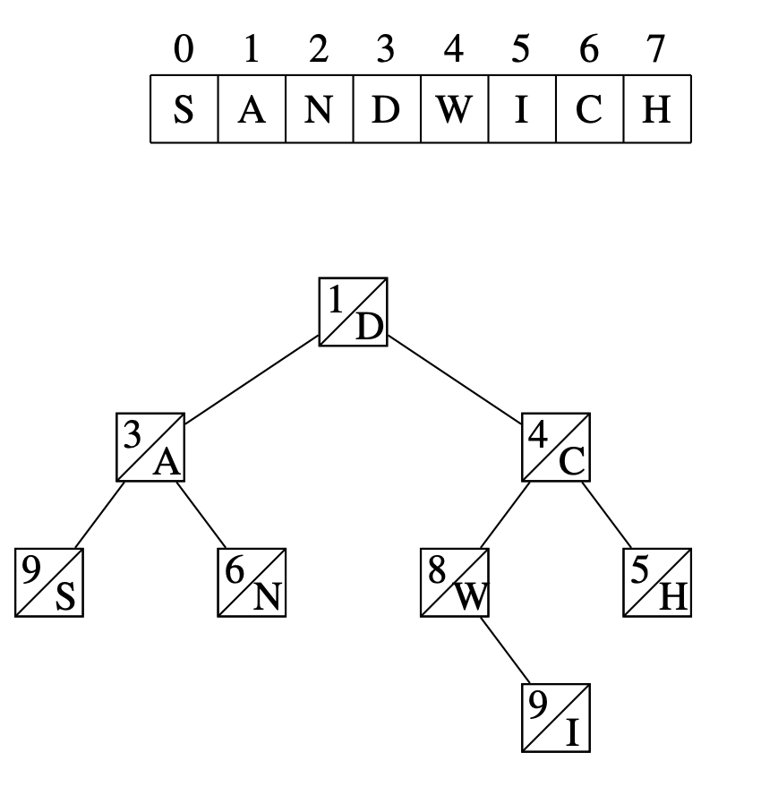

# Cartesian Tree/Treap/Randomized Binary Search Tree [(C++)](./cartesian-tree.cpp)

# TODO: Code not working

## About

A treap ($tree + heap \Rightarrow treap$) is a binary tree that can store the contents of an array in such a way that we can efficiently split an array into two arrays and merge two arrays into an array. Each node in a treap has two values: a weight and a value. Each node's weight is smaller or equal than the weights of its children, and the node is located in the array after all nodes in its left subtree and before all nodes in its right subtree. If you choose the priorities randomly, you will get non-degenerate trees on average, which will ensure $\theta(log \ n)$ complexity for the main operations. Hence another name of this data structure - **randomized binary search tree**.

**Degenerate Tree:**

**Example of a Treap:**

## Splitting

When a new node is added to the treap, it is assigned a random weight. This guarantees that the tree is balanced (its height is $\theta(log \ n)$) with high probability and its operations can be performed efficiently.
