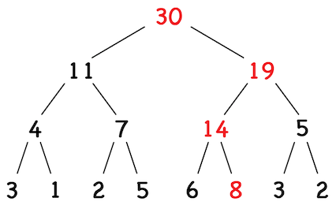

# Segment Tree

## About

#### **[Go to OJ](https://codeforces.com/edu/course/2/lesson/4/1/practice/contest/273169/problem/A)**

In this task, you need to write a regular segment tree for the sum.

**Input:**

The first line contains two integers $n$ and $m$ ($1 \leq n, m \leq 100000$), the size of the array and the number of operations. The next line contains $n$ numbers $a_i$, the initial state of the array ($0 \leq a_i \leq 10^9$ - use `long long`). The following lines contain the description of the operations. The description of each operation is as follows:

-   $1 \ i \ v$: set the element with index $i$ to $v$ ($0 \leq i < n$, $0 \leq v \leq 10^9$).
-   $2 \ l \ r$: calculate the sum of elements with indices from $l$ to $r - 1$ ($0 \leq l < r \leq n$).

```python
5 5
5 4 2 3 5
2 0 3
1 1 1
2 0 3
1 3 1
2 0 5
```

**Output:**

For each operation of the second type print the corresponding sum.

```python
11
8
14
```

## The Problem with Prefix Sums

We could use prefix sums for this problem for $\theta(1)$ queries, but we $\theta(n)$ updates, which is too slow.

One approach is to use segment tree for $\theta(log \ n)$ time on both operations. [Fenwick Tree](../fenwick-tree/README.md) also has $\theta(log \ n)$ time for both operations, but has a smaller constant factor.

## **Important Note on the Code - READ THIS TO AVOID $\color{red}{\text{WA}}$**

-   See [this](https://graphics.stanford.edu/~seander/bithacks.html#RoundUpPowerOf2) to learn more on round a number up to a number $\geq n$ when $n$ is an integer. For most content problems, this is not the case and the code doesn't use `bithacks` for this reason.
-   The $sum$ operation on the code only returns the sum of $\sum arr[i] \text{ where } i \in [a, b)$. If $b$ is included in the sum, $\text{++}b$ must be performed.

## Structure of a Segment Tree

Imagine we need to build a segment tree for the array $[3, 1, 2, 5, 6, 4, 3, 2]$.


This is a balanced binary tree, with height $log_2(n + 1)$ (the height grows logarithmically with the number of nodes), leaves of which there are elements of the original array, and each internal node (node of a tree that has one or more child nodes) contains the sum of the numbers in its children.

Note that the tree turned out so beautiful, because the length of the array was a power of two. If the length of the array is not a power of two, you can extend the array with zeroes to the nearest power of two. In this case, the length of the array will increase no more than twice, so the asymptotic time complexity of the operations will not change.

Now let's look at how to do operations on such a tree.

## Initializing the Segment Tree

In the initializing the segment tree, we take in the $n$ - the size of the array. We then create a segment tree of size [smallest power of $2$ that is $\geq n$, where $n$ is the size of the array](https://www.geeksforgeeks.org/smallest-power-of-2-greater-than-or-equal-to-n/).

Then, for each element in the array, we perform an update operation on the segment tree.

## Updating Elements to the Segment Tree

Let's start with the operation set. When the element of the array changes, you need to change the corresponding number in the leaf node of the tree, and then recalculate the values ​​that will change from this. These are the values ​​that are higher up the tree from the modified leaf. We can simply recalculate the value in each node as the sum of the values ​​in children.

**Original:**


**Update $4$ to $8$**



When performing such an operation, we need to recalculate one node on each layer of the tree. We have only $log \ n$ layers, so the operation time will be $\theta(log \ n)$.

## Answering Queries

Now let's look at how to calculate the sum on a segment. To do this, let's first see what kind of numbers are written in the nodes of the segment tree. Note that these numbers are the sums on some segments of the original array.


In this case, for example, the number in the root is the sum over the entire array, and the numbers in the leaves are the sum over the segment of one element.

Let's try to build the sum on the segment $[l, r]$ from these already calculated sums. To do this, we run a recursive traversal of the segment tree. In this case, we will interrupt recursion in one of two situations:

1. The segment corresponding to the current node does not intersect the segment $[l, r]$. In this case, all the elements in this subtree are outside the area in which we need to calculate the sum, so we can stop the recursion.
2. The segment corresponding to the current node is entirely nested in the segment $[l, r]$. In this case, all the elements in this subtree are in the area in which we need to calculate the sum, so we need to add to the answer their sum, which is recorded in the current node.


Here, the crosses indicate the vertices at which the recursion broke off in the first cutoff, and the vertices in which the number was added to the answer are circled.

How long does such a tree traversal work? To answer this question, we need to understand how many nodes none of the cutoffs will happen in, and we will need to go deeper into the tree. Each such case gives us a new branch of recursion. It turns out that there will be quite a few such nodes. The fact is that in order for none of the cutoffs to work, the segment corresponding to the node of the tree must intersect the query segment, but not be contained in it entirely. This is only possible if it contains one of the boundaries of the segment $[l, r]$. But on each layer of the tree of segments there can be no more than one segment containing each of the boundaries. Thus, there can be no more than $2 \ log \ n$ nodes at which cutoffs did not work, and, therefore, the general asymptotic time of this procedure will be $\theta(log \ n)$.

## Fenwick Tree vs. Segment Tree

| Type          | Fenwick Tree                                                                              | Segment Tree                                                                                                                                                   |
| ------------- | ----------------------------------------------------------------------------------------- | -------------------------------------------------------------------------------------------------------------------------------------------------------------- |
| Preprocessing | $\theta(n \ log \ n)$                                                                     | $\theta(n)$                                                                                                                                                    |
| Query         | $\theta(log \ n)$                                                                         | $\theta(log \ n)$                                                                                                                                              |
| Overall Time  | Suitable for time-constraint problems, as smaller hidden constants (see **applications**) | Ok for general problems, for time-constraint problems, consider using a Fenwick Tree (see **applications**)                                                    |
| Applications  | Only answers on queries from $[0, b]$                                                     | All queries                                                                                                                                                    |
| Code          | Short                                                                                     | Long, prepare a template                                                                                                                                       |
| Online        | Online                                                                                    | Not online, can be online using a [Dynamic Segment Tree](https://www.geeksforgeeks.org/dynamic-segment-trees-online-queries-for-range-sum-with-point-updates/) |
| Memory Usage  | $n$                                                                                       | Up to $2n$, though using more memory allows more problems to be solved                                                                                         |

# TODO: Add https://cp-algorithms.com/data_structures/segment_tree.html advanced segment tree version
