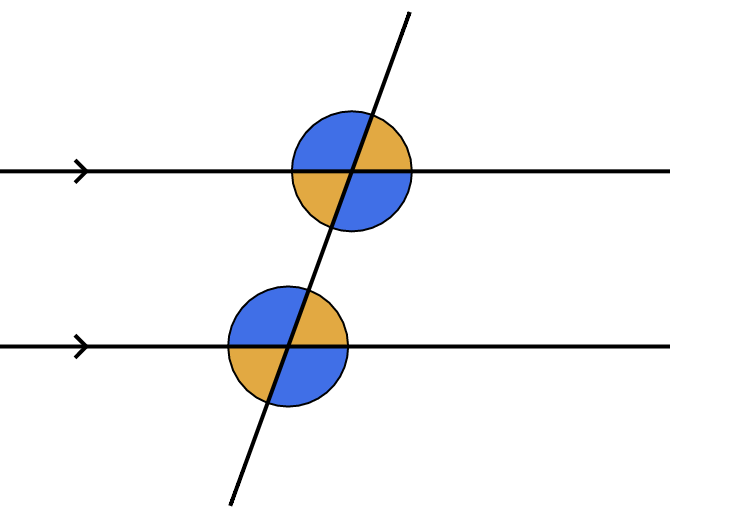

# Angles

## Straight Angle

A line has $180^\circ$, as it is a semicircle ($360^\circ * \frac{1}{2} = 180^\circ$).

---

## Supplementary Angle

Two angles that add to $180^\circ$ are called supplementary angles.

---

## Complementary Angle

Similarly, two angles that add to $90^\circ$ are called complementary angles.

---

## Other Types of Angles

-   **Right Angle**: An angle $a$ where $a = 90^\circ$
-   **Acute Angle**: An angle $a$ where $a < 90^\circ$
-   **Obtuse Angle**: An angle $a$ where $a > 90^\circ$ and $a < 180^\circ$
-   **Reflex Angle**: An angle $a$ where $a > 180^\circ$

---

## What does $\angle ABC$ even mean?

It means we create the line from point $A$ going to point $B$ and another line going to point $C$. We then get the angle formed by the lines and that gives us degree of angle $\angle ABC$ (simply as $\angle B$).

---

## Exterior Angle Theorem

Suppose we have the following triangle:

The Exterior Triangle Theorem states that $d = a + c$.

---

## Parallel Lines Theorem

The Parallel Lines Theorem states that the blue shaded angles are the same and the yellow shaded angles are the same. This is correct because of [transversal](<https://en.wikipedia.org/wiki/Transversal_(geometry)#:~:text=First%2C%20if%20a%20transversal%20intersects,then%20the%20lines%20are%20parallel.>) - alternate angles have the same degree.

---

## Practice

-   https://brilliant.org/practice/angle-hunting-6/?chapter=2d-geometry
-   https://brilliant.org/practice/geometry-warmup-angles-and-lines/?subtopic=geometric-measurement&chapter=angles-and-lines
