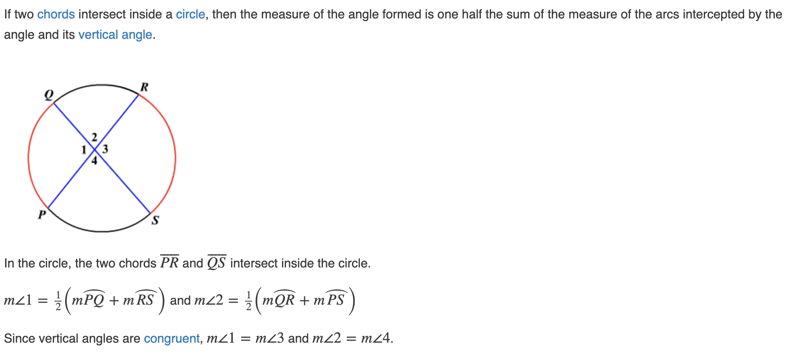

# Circles

## About

## Circumference

The perimeter of a circle (known as the *circumference* of a circle), can be calculated with the formula below:

$$C = 2 \pi r = \pi d$$

## Area

The area of a circle can be found with the formula below:

$$A = \pi r^2$$

## Finding the Radius

The radius of a circle can be found based on the diameter.

$$r = \frac{d}{2}$$

## Arcs

## Arc Measure Formula

$$\text{arc measure} = \frac{\text{arc length}}{2}$$

## Intersecting Chords Theorem

Given the following circle, $|AS| \times |SC| = |BS| \times |DS|$.

## Angles of Intersecting Chords Theorem

