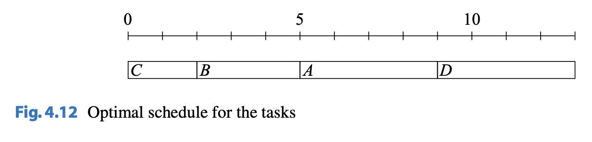
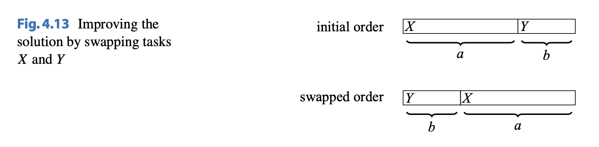

# Sweep Line Algorithms

A sweep line algorithm models a problem as a set of events that are processed in a sorted order.

## Example 1: The Restaurant Problem

The restaurant problem is "Given a list of the arriving and leaving times of all customers on a certain day, find the maximum number of customers who visited the restaurant at the same time. An example of the problem where there are four customers $A$, $B$, $C$, and $D$:

To solve the problem, we create two events for each customer: one event for arrival and another event for leaving. Then, we sort the events and go through them
according to their times. To find the maximum number of customers, we maintain
a counter whose value increases when a customer arrives and decreases when a
customer leaves. The largest value of the counter is the answer to the problem. This images shows the events in the sample: Each customer is assigned
two events: “+” denotes an arriving customer, and “−” denotes a leaving customer.
The resulting algorithm works in $\theta(n \ log \ n)$ time, because sorting the events takes
$\theta(n \ log \ n)$ time and the sweep line part takes $\theta(n)$ time.

## Example 2: Tasks and Deadlines

We are given $n$ tasks with durations and deadlines and our task is to find the order to perform the tasks. For each task, we earn $d - x$ points, where $d$ is the task's deadline and $x$ is the moment when we finish the task. For example, suppose we have 4 tasks:

| Task | Duration | Deadline |
| ---- | -------- | -------- |
| $A$  | $4$      | $2$      |
| $B$  | $3$      | $10$     |
| $C$  | $2$      | $8$      |
| $D$  | $4$      | $15$     |

An optimal solution for this problem is shown below:

Using this schedule, our total score is $6$ as:

-   Task $A$: $-7$ points
-   Task $B$: $5$ points
-   Task $C$: $6$ points
-   Task $D$: $2$ points

As it turns out, the optimal solution to this problem doesn't depend on the deadlines. Instead, we can simply sort the tasks by their duration in ascending order. Then, we can use a greedy strategy. One important thing to note that is if there are two tasks $A$ and $B$ with durations $D_a$ and $D_b$, if $a > b$, Task $Y$ shall be completed before Task $X$. An example of this is shown below:

