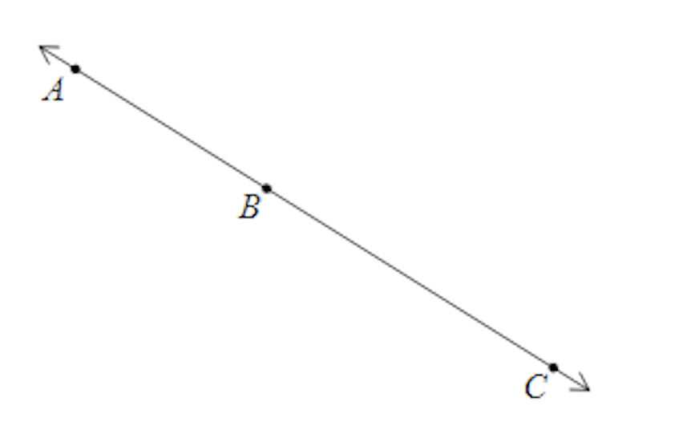

# Terminology

## Plane Geometry vs. Solid Geometry

Geometry can be divided into:

- Plane Geometry is about flat shapes like lines, circles and triangles ... shapes that can be drawn on a piece of paper

- Solid Geometry is about three dimensional objects like cubes, prisms, cylinders and spheres.

---

## Geometry Terminology (Basics)

### Points

A dot. A speck. It's a point. A point has no dimensions and no direction. It is a specific location in space, and is typically named with a single letter.

### Line Segments

A line segment connects two points. A line segment is a finite piece of a line. Unlike lines, a line segment don't extend infinitely in both directions, unlike a line. The points at the ends of a line segment are called endpoints.

The figure below has 3 line segments and the lines marks that the length with the line segments have the same length. Also, the point $M$ marks the midpoint of the line segment $\overline{XY}$. Note that the length of the line segment is $XY$.

### Rays

A ray has a point and a line that goes forever in one direction. Representing a ray can be done with a letter (eg. $A$) with a line on top representing the direction of the ray.

### Lines

A lines has infinitely many points and goes in both directions. Normally, a line is represented with a lowercase letter (eg. $k$). Also, a line can be represented with lowercase letter with a line on top.

### Collinear Points

If three or more points are on the same line, we say the points are collinear.

### Concurrent Lines

If three or more lines pass through the same point, we say the lines are concurrent.

---

## Geometry Terminology (Circles)

A line is tangent is one part of the line is touching a point of the circle, but has not entered into the circle's space. The line in the image above that is tangent to the circle $C$ is line $l$.

---

## Cones

The volume of a cone is

$$V = \frac{1}{3} \pi r^2 h$$

And the surface area:

$$S = \pi r l + \pi r^2$$

$l$ is also commonly refereed to as the slant height. You can find the slant height using the Pythagorean Theorem ($h^2 + r^2 = l^2$).

---

## Definitions

* **regular polygons**

all sides are equal and all angles are equal

* **diagonal**

a line between two different vertices of a polygon which is not just a side

* **equilateral triangles**

triangles which have equal side lengths and equal angles

## Summary

