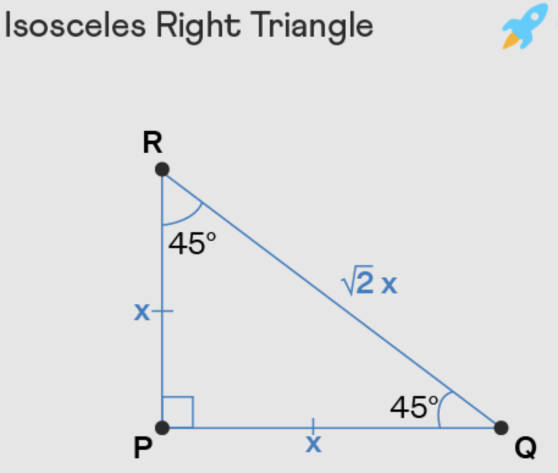
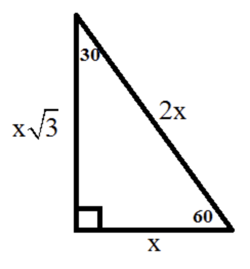
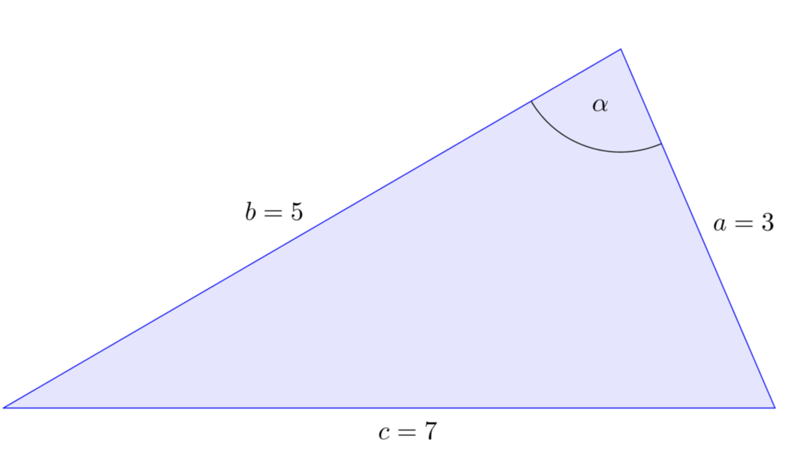

# Triangles

## Special Triangles

### $45-45-90$ Triangle (Isosceles right triangle)

### $30-60-90$ Triangle

### $3-5-7$ Triangle

$\alpha = 120$ (the largest angle / angle opposite the largest side $7$)

## $8-15-17$ Triangle

This is a right triangle.

## $3-4-5$/$6-8-10$ Triangle

This is a right triangle.
