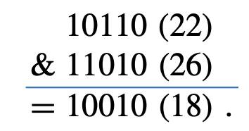
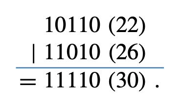
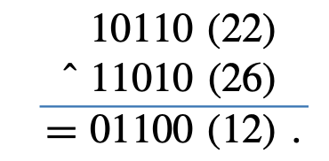
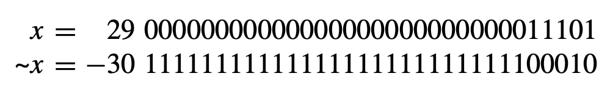
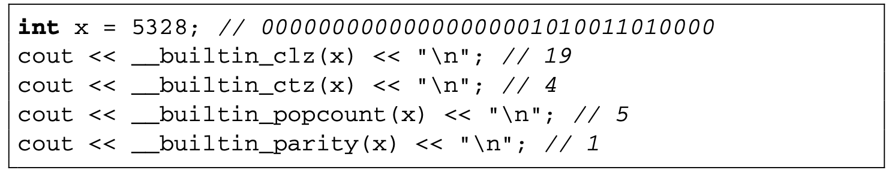
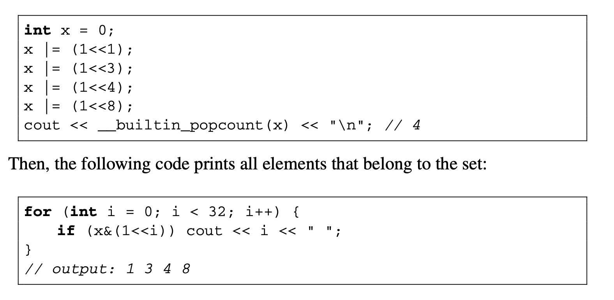
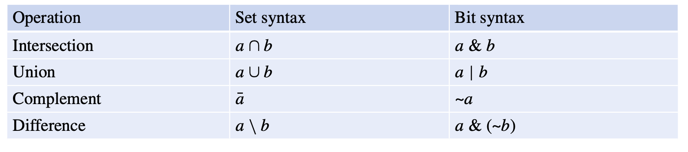

# Bit Manipulation

## Binary Numbers

In programming, an $n$-bit integer is stored as a binary number that consists of $n$ bits. For example C++'s built-in `int` data type is $32$-bits. If we were to represent $43$ in binary the $(truncated)$ version is $101011$.

**NOTE: We don't care about the 0s before the first 1 in binary.**

## Signed & Unsigned

Bit representations of a number is either signed or unsigned. A signed number is a number that can be positive and negative. On the other hand, an unsigned number cannot be negative. An example of this with `int`:

-   `int`: $-2^{31}$ - $2^{31} - 1$
-   `unsigned int`: $0$ - $2^{32} - 1$

## Overflow

If an number is larger than upper bound of the bit representation, the number will overflow. In a signed representation, the next number after $2^{n - 1} - 1$ is $-2^{n - 1}$.

## Bit Operations

### AND Operation (Masking)

The & operation between $x$ & $y$ returns 1 for every two bits between $x$ and $y$ that are both 1 at index $i$.



### OR Operation (Merging)

The | operation between $x$ | $y$ returns 1 if the bit at position $i$ in $x$ or $y$ is 1.



### XOR Operation

The ^ operation between $x$ ^ $y$ returns 1 if the bit at position $i$ in $x$ is 1 and the bit at position $i$ in $y$ is 0 (or vice versa).



### NOT Operation

The ~ operation returns 1 if the position $i$ at $x$ is 0 or 0 if the position $i$ at $x$ is 1.



## Bit Shifts

### Left Shift <<

The left shift operation $x << k$ can be used to add $k$ zero bits to $x$.

**Usage:**

```cpp
x << 2; // adds 2 0s to the end of x
```

### Right Shift >>

The right shift operation $x >> k$ removes $k$ bits $x$.

**Usage:**

```cpp
x >> 2; // removes 2 bits from the end of x
```

## Bit Masks

A bit mask is of the form $1 << k$. We impose a "mask" over bits. An example of a bit mask using **AND**:

```
     1 1 1 0 1 1 0 1   [input]
(&)  0 0 1 1 1 1 0 0    [mask]
------------------------------
     0 0 1 0 1 1 0 0  [output]
```

[Source (Stack Overflow)](https://stackoverflow.com/a/53722721)

## Additional Useful Functions

-   `__builtin_clz(x)`: the number of zeros at the beginning of the bit representation
-   `__builtin_ctz(x)`: the number of zeros at the end of the bit representation
-   `__builtin_popcount(x)`: the number of ones in the bit representation
-   `__builtin_parity(x)`: the parity (even or odd) of the number of ones in the
    bit representation.

An example of these functions:



**⚠️ Warning: The functions mentioned above only works for integers. For `long long` functions, append the `ll` suffix.**

## Representing Sets [Example](set-using-int.cpp)

A example of the binary operations can be used to model the set $S = \{1, 3, 4, 8\}$ with an integer.



## Set Operations

Note that the standard set operations can be modeled with binary operators:


