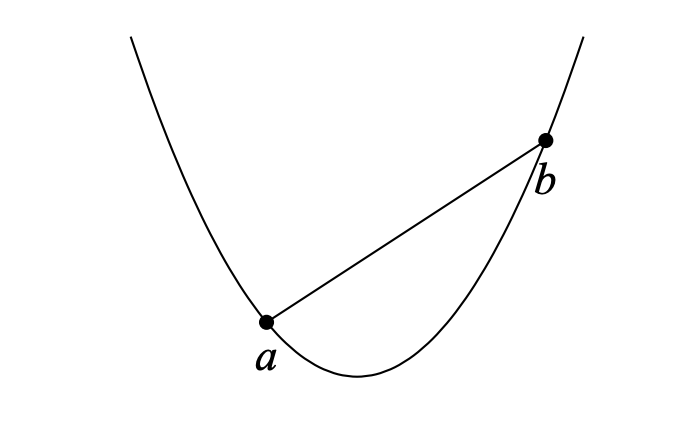

# Convex Functions

## About

A function is convex if a line segment between any two points on the graph of the function always lies above or on the graph. For example, the function $f(x) = x^2$ is convex:

If we know that the minimum value of a convex function is between $[x_L, x_R]$, we can then use ternary search to find it. However, note that many different points of a convex function may have the minimum value. For example, $f(x) = 0$ is convex and its minimum value is $0$.

## 🤩 BONUS! 🤩

Convex functions have some useful properties. Assume that $f(x)$ and $g(x)$ are convex functions. Then, the following functions are also convex:

-   $f(x) + g(x)$
-   $max(f(x), g(x))$
