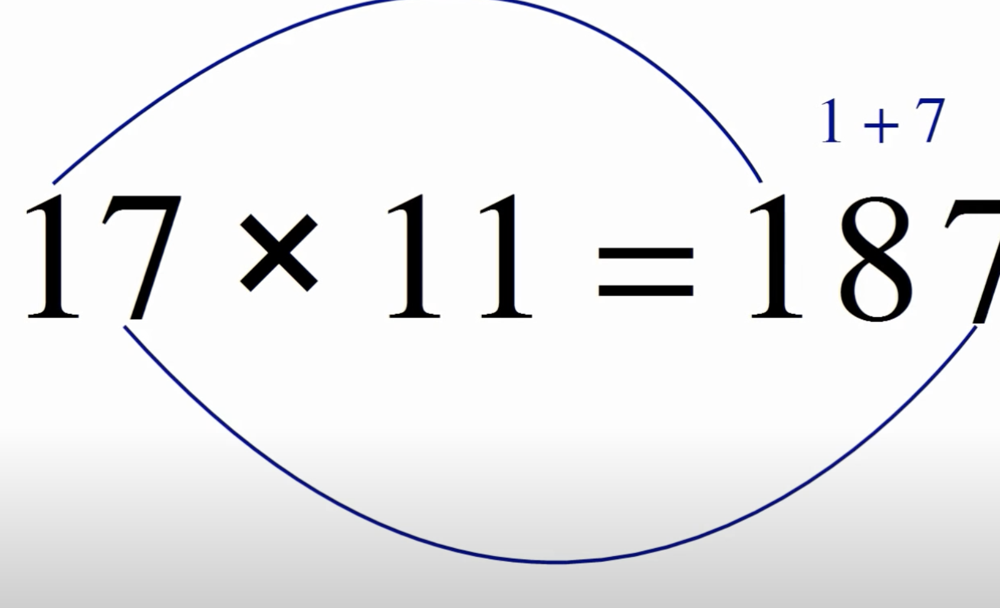

# Fun Computation Tricks

## Multiplying by $11$

> [Video Explanation by ***MindYourDecisions***](https://www.youtube.com/watch?v=VT76IaPudsI)

> [Does the multiplication by 11 trick work for numbers that aren't two digits?]
>
> Yes. $123 \times 11 = 1353$
>
> ***Explanation:*** The answer begins with $1$ and ends with $3$. Since $1 + 2 = 3$ and $2 + 3 =5$, you take out the $2$ and "insert" the $3$ and $5$ to get $1353$.

## Squaring Numbers Ending in $5$

> [Video Explanation by ***MindYourDecisions***](https://youtu.be/oV7Kxm3Zr_c?t=15)

Say you want to compute $25^2$.

1. "Remove" the square. $25$
2. "Remove" the 5. $2$
3. Multiply the current number $n$ with $n + 1$. So, we multiply $2$ with $2 + 1 = 3$, giving us $6$.
4. "Add" 25. $625$
