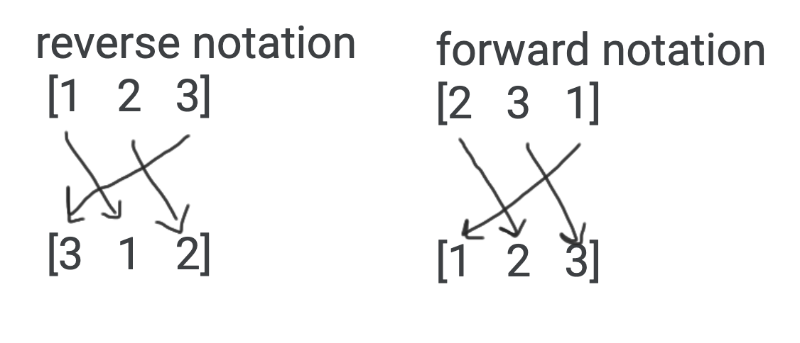
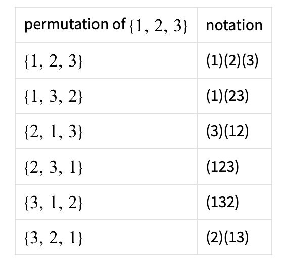
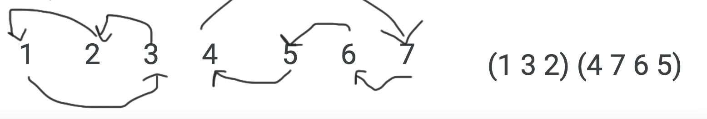

# Permutations

> Permutations is related to the field of **group theory**.

## About

A permutation is an arrangement of $n$ numbers in an array.

> **FORMULA:** The # of permutations in an array of $n$ numbers is $n!$.

> ***SIDENOTE:*** ***[Heap's Algorithm for Fast Permutation Generation](https://github.com/aaronhma/algorithms/tree/master/algorithms/techniques/permutations/heap)***

Sometimes a permutation is illustrated by showing the set before and after the permutation, with an arrow from each element to its new position. For example, the permutations {$1,3,2$} and {$2,1,3$} can be illustrated as follows:


The identity permutation of a set is the permutation that leaves the set unchanged, or the function which maps each element to itself. In our example, the identity permutation is {$1,2,3$}.

> **WARNING:** We're assuming the permutation {$1, 3, 2$} is $A$ and {$2, 1, 3$} is $B$.

## Composition of Two Permuations (Merge)

The composition of two permutations of the same set is just the composition of the associated functions. For example, the permutations {$1,3,2$} and {$2,1,3$} can be composed by tracing the destination of each element.


> ***SIDENOTE:*** "$\circ$" is the notation for the composition (merging) of two permutations, though not including "$\circ$" is also valid.

In the picture above, the left side is $B \circ A$ and the right side is $A \circ B$. $B \circ A$ means "apply $A$ then $B$" and $AB$ means "apply $B$ then $A$".

> **WARNING:** The composition of two permutations is not commutative, that is, $A \circ B \ne B \circ A$.

> ***SIDENOTE:*** Read about identity permutations [here](#identity-permutations).

Raising a permutation to a "power" is the same thing as performing the composition of a permutation on itself many times.

For example, if $A = [3, 1, 2]$ (in forward notation), then:

- $A^0 = I = [1, 2, 3]$
- $A^1 = A = [3, 1, 2]$
- $A^2 = [3, 1, 2] \times [3, 1, 2]$
- If $A^k = I$, then $A^{k + 1} = A$.
- $A^n = A^{n - k} = A^{n \text{ mod } k}$

The order of a permutation is the smallest power needed to raise a permutation to the identity. In other works, if $A^k$ is the identity, $A^1 \text{...} A^{k - 1}$ are **not** the identity, but $A^k$ is.

It's guaranteed that when you raise a permutation to higher and higher powers, you'll get the identity permutation.

## Forward & Reverse Notation

> **NOTE:** Forward notation is the default notation that is used when refering to permutations.

*Forward* notation is where we try to find a permutation that after going through the permutation's "reordering steps", we get a permutation we want.

```
[2, 1, 3] <-- forward notation


[1, 2, 3]
```

*Reverse* notation is the permutation we get after going through the permutation's "reordering steps".

```
[1, 2, 3]

[2, 1, 3] <-- reverse notation
```



> **WARNING:** The forward notation and reverse notation are not always the same, even if the "arrows" are the same!

## Division of Permutations

If $AB = C$, then $B = \frac{C}{A} = A^{-1} \times C$. $A^{-1} \times A = I$.

## Identity Permutations ([code](https://pastebin.com/DrgrAsJL))

> **DEFINITION:** The identify is the permutation that doesn't move anything around ($[1, 2, ..., n - 1, n]$).

- $IP = PI = I$ for any $P$
- There is only $1$ identity permutation for any given size
- If $AB = I$, then $BA = I$.

> **NOTE:** The identity permutation of a permutation $A$ is $A^{-1}$.

## Inverse Permutations

> **DEFINITION:** $A$ and $B$ are "inverses" of each other if $AB$ is the identity and $BA$ is the identity, and $B$ "undoes" $A$ (and vice versa). For example, if $A = [2, 3, 1, 4]$, then $B = [3, 1, 2, 4]$ is the inverse of $A$.

- If $B$ is the inverse of $A$, then $A$ is the inverse of $B$.
- Every permutation has an inverse.
- A permutation cannot have two inverses. (Composition of inverses is injective)

## Even & Odd Permutation

* An even permutation is a permutation that is obtained with an even # of $2$-element swaps.
* An odd permutation is a permutation that is obtained with an odd # of $2$-element swaps.

## Example: The Fifteen-Tile Puzzle

A popular puzzle involves a set of fifteen sliding tiles in a $4 \times 4$ square:

```
       1   2   3   4
       5   6   7   8
       9  10  11  12
      13  14  15
```

The sixteenth position is blank. The tiles can be rearranged by moving adjacent tiles into the blank. Through repeated moves of this kind, we can rearrange the tiles, as in this example:

```
       1   2   3   4      1   2   3   4      1   2   3   4
       5   6   7   8      5   6   7   8      5   6   7   8
       9  10  11  12      9  10  11  12      9  10      12
      13  15  14         13  15      14     13  15  11  14

       1   2   3   4      1   2   3   4
       5   6   7   8      5   6   7   8
       9  10  12          9  10  12  14
      13  15  11  14     13  15  11
```

Suppose we want to obtain the following result:

```
       1   2   3   4
       5   6   7   8
       9  10  11  12
      13  15  14
```

It is easy to show that the current game state makes winning impossible. Each arrangement is a permutation of sixteen items, where the blank space is considered as the sixteenth item. Each move involves the exchange of a tile with the blank space. The number of moves must be even, because the space must move up and down equal numbers of spaces, and right and left equal numbers of spaces, if it is to be returned to its original position in the lower right corner.

The desired result is an odd permutation, since it results from a single exchange. Hence it cannot be reached in the specified manner.

## Permutation Cycle + Cycle Notation

> **NOTE:** The order of the cycles does not matter. So for $\{ 1, 2, 3 \}$, $(1)(2)(3)$, $(3)(1)(2)$, etc. all works.



A example of $P = [7, 1, 2, 3, 4, 5, 6]$ in cycle notation:



The order of a permutation is divisible by all cycle sizes, so the order of a permutation (with cycles) is $LCM[\text{length of cycle}_1, \text{length of cycle}_2, ...]$.

The longest possible cycle that a permutation of size $n$ can contain is $n$, while the shortest possible is $1$.

## Injectivity

A function is called injective if no two inputs give the same output. In other words, if $f(a) = f(b)$, then $a = b$.

- If we define a permutation as $P(k) = \text{the element at position } k \text{ in the permutation}$, then the function is injective.

## A "Trick" For Elements Moving

> **TRICK:** The # at the index at the index is where the element would be moved.

For example, if $P = [2,1, 3, 4, 5]$, $PP$ starts with $P = [2, 1, 3, 4, 5]$, then applying $P$.

Since $P[1] = 2$, $PP[2] = 2$. Since $P[2] = 1$, $PP[1] = 1$, etc.

## Resources

- [Further Reading + Proof](http://www.efgh.com/math/algebra/permutations.htm)
