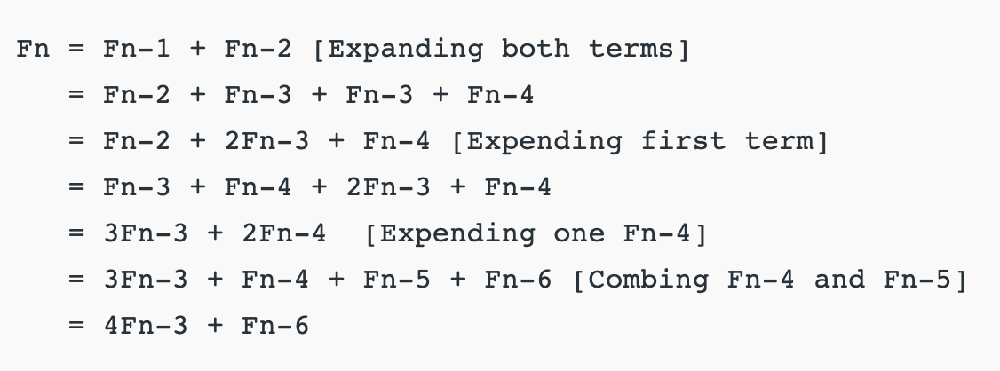

# Print all the Even Fibonacci #s upto $x$

## Example

```python
> x = 612
> evenFib(x)
0 2 8 34 144 610
```

## Approach 1: Mathematics

### Analyzing the Fibonacci Sequence

The Fibonacci sequence is $0, 1, 1, 2, 3, 5, 8, 13, 21, 34, 55, 89, 144$.

Upon careful examination, we find that every third number in the Fibonacci sequence is even.

### Defining the Recurrence Relation

We can find the recurrence relation for the Even Fibonacci sequence:



Since every $3$rd Fibonacci number is even, if $F_n$ is even, then $F_{n - 3}$ and $F_{n - 6}$ is also even. We can now define the recurrence relation:

$$\text{Even Fibonacci} = 4F_{n - 3} + F_{n - 6}$$

Where the following base cases hold:

$F_0 = 0$

$F_3 = 2$

### Code

```cpp
#include <bits/stdc++.h>

using namespace std;

int main()
{
  ios_base::sync_with_stdio(false);
  cin.tie(NULL);

  // a = F_(n - 6)
  // b = F_(n - 3)
  // c = F_n
  // x = max value of even Fibonacci to be printed out
  // long long to prevent overflow
  // At the start, we have the F_0 = 0 and F_3 = 2.
  long long a = 0, b = 2, c = 2, x;
  cin >> x;

  // if x < 2, we don't print anything except 0
  if (x < 2) {
    cout << "0\n";
    exit(EXIT_SUCCESS);
  }

  // print the first two numbers
  cout << "0 2 ";

  // Print all the even Fibonacci #s less than or equal to x.
  while (c <= x) {
    // The formula for the n-th even Fibonacci number is
    // 4 * F_(n - 3) + F_(n - 6)
    // Learn more: https://www.geeksforgeeks.org/nth-even-fibonacci-number/.
    c = 4 * b + a;

    // update F_(n - 6)
    a = b;

    // update F_(n - 3)
    b = c;

    // If the current even Fibonacci number exceeds x, exit.
    if (c > x) break;

    // We found a new even Fibonacci number, print it out.
    cout << c << " ";
  }

  cout << "\n";

  return 0;
}
```
