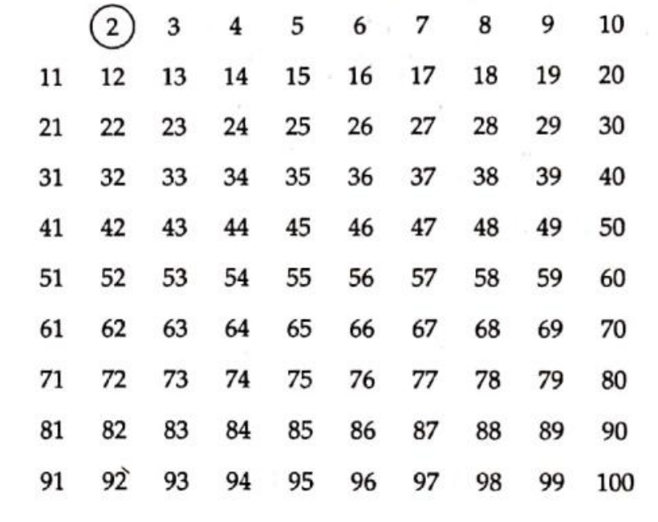
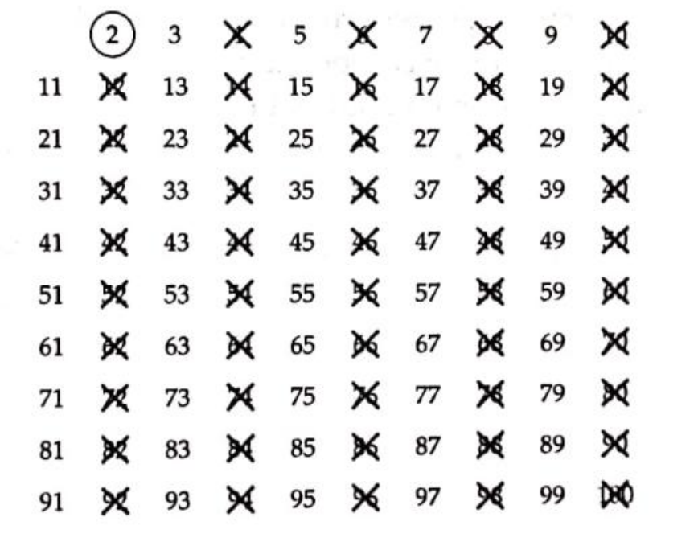
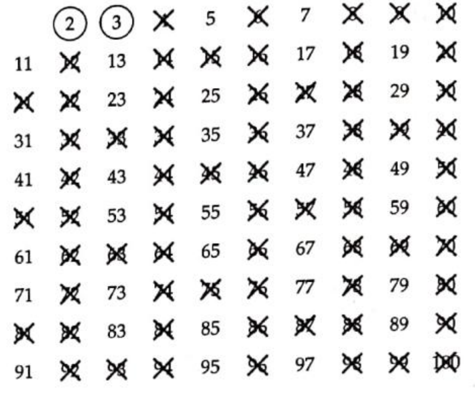
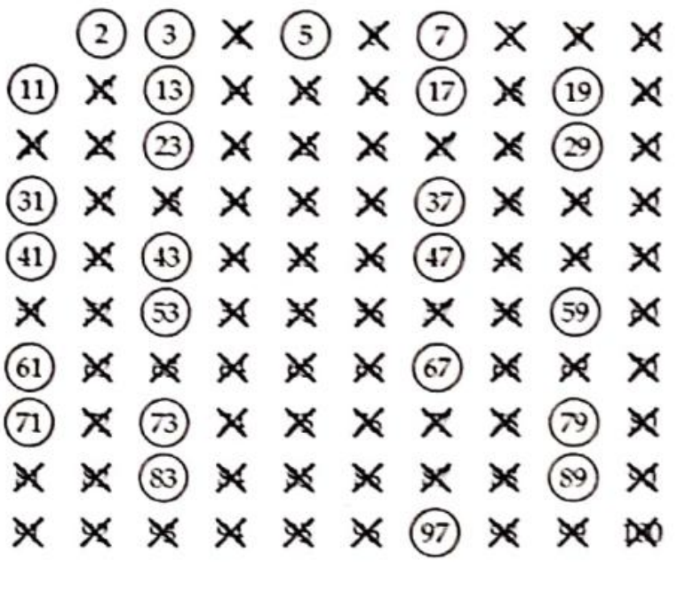

# Chapter 2 - _Primes & Composites_

## Definitions

- A **prime number** (aka **prime**) is a natural number $p$ where $p \geq 2$ whose only positive divisors are $1$ and $p$.
- A **composite number** (aka **composite**) is a natural number $c$ with some positive divisors besides $1$ and $c$ and can be written as $c = a * b$ where $a$ and $b$ are (not necessarily distinct) divisors of the composite number $c$.

---

## Sieve of Eratosthenes

The Sieve of Eratosthenes was named after the Greek mathematician Eratosthenes who divised the algorithm in about $230$ BC. With the Sieve of Eratosthenes, we can easily find the prime numbers between $2$ and $n$. Assume that $n = 100$:

1. Create all the numbers from $2$ to $n$.

2. Circle the first prime number.

3. Cross out all multiples of this number.

4. Go to the next unmarked number, circle it and cross out all the multiples of that number.

5. Repeat until all numbers is either circled or crossed out.

---

## Testing a Number for Divisibility

**ℹ️ Important: If a natural number $n$ where $n > 1$ has no prime divisors less than or equal to $\sqrt{n}$, then $n$ is prime.**

As an example, to see if $209$ is prime, we know that $\sqrt{209} \approx 14$. Then, we can test all the prime numbers from $2$ to $13$ ($\{ 2, 3, 5, 7, 11, 13 \}$). After finding that $\frac{209}{11}$ results in an integer, we can conclude that $209$ is composite.

---

## ℹ️ Important Things to Know 🧠

- $1$ is the only natural number that is neither prime nor composite. It only has one positive divisor$-$itself.
- For a prime number $p$, the smallest composite number that has no prime divisors less than $p$ is $p^2$.
