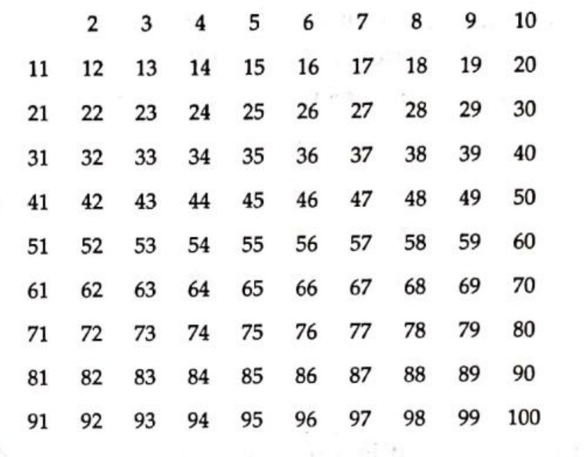
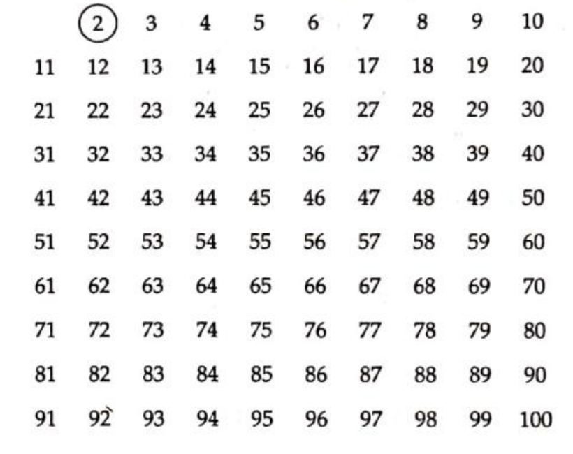
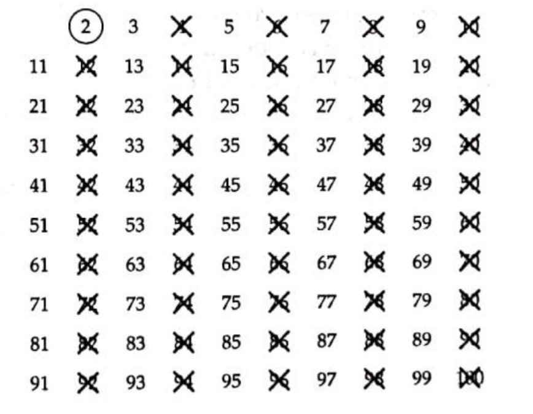
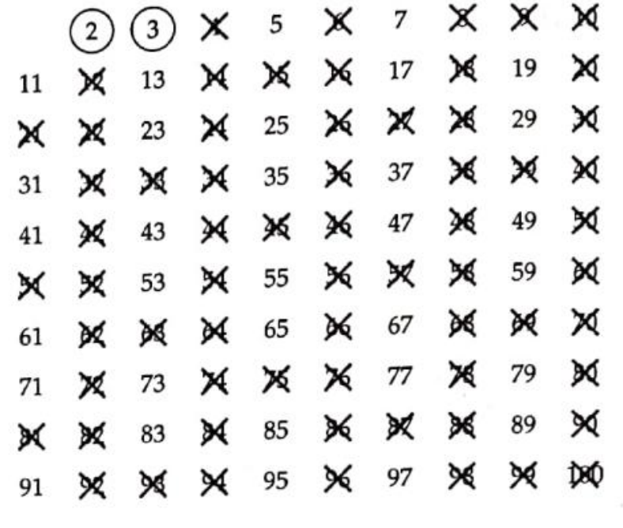

# Sieve of Eratosthenes [(C++)](./sieve.cpp)

## The Problem

Given $n$, print all the prime numbers from $2$ to $n$.


## Concept: Sieve of Eratosthenes

The Sieve of Eratosthenes was named after the Greek mathematician Eratosthenes who divised the algorithm in about $230$ BC. With the Sieve of Eratosthenes, we can easily find the prime numbers between $2$ and $n$. Assume that $n = 100$:

1. Create all the numbers from $2$ to $n$.



2. Circle the first prime number.



3. Cross out all multiples of this number.



4. Go to the next unmarked number, circle it and cross out all the multiples of that number.



5. Repeat until all numbers is either circled or crossed out.


## Approach 1: Simulation

The Sieve of Eratosthenes can be simulated for a time complexity of $\theta(n \ log \ n)$:

```cpp
// 0: prime
// 1: composite
vector<int> sieve(n + 1, 0);

// Don't check the numbers after n / 2 because we have already marked them.
for (int i = 2; i <= n / 2; i++)
{
  // if this number has already been marked as composite, skip this number
  if (sieve[i])
    continue;

  // mark all multiples of this number as composite
  for (int j = 2 * i; j <= n; j += i)
    sieve[j] = 1;
}

return sieve;
```
