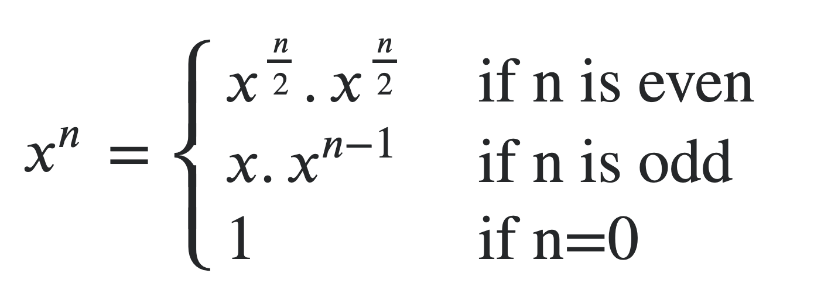

# Implement `pow(x, n)` or $x^n$

## Example

```cpp
> x = 5
> n = 2
> pow(x, n) = 25
```

## Approach 1: Brute Force

```cpp
// to prevent overflow, we'll use long long
long long ans = 1;

for (int i = 1; i <= n; i++) {
  ans *= x;
}
```

## Approach 2: Fast Exponentiation

**ℹ️ C++ STL's implementation of `pow(x, n)` does not use fast exponentiation.**

We can divide the problem into $3$ cases:



This works in $\theta(log \ n)$ time.

Then, all we have to do is implement this:

```cpp
// Extended version that allows the pow function to work for negative y and float x.
float pow(float x, int y)
{
    float temp;
    if(y == 0)
        return 1;
    temp = pow(x, y / 2);
    if (y % 2 == 0)
        return temp * temp;
    else
    {
        if(y > 0)
            return x * temp * temp;
        else
            return (temp * temp) / x;
    }
}
```

## **[Learn More](https://www.geeksforgeeks.org/write-a-c-program-to-calculate-powxn/)**
