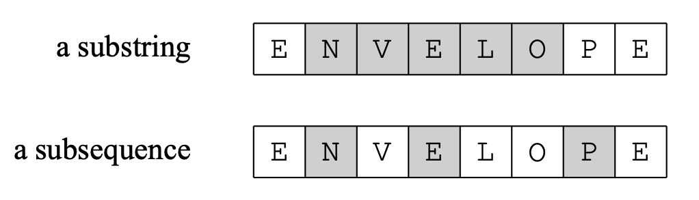

# Basic Topics

## Strings

A string $s$ contains $n$ characters from an alphabet. We assume that all strings are zero indexed.

## Alphabet

An alphabet defines the characters that can be used in strings. For example, the alphabet $\{ a, b, c, ..., x, y, z\}$ consists of the lowercase Latin letters.

## Substrings and Subsequences

A substring is a sequence of consecutive characters in a string. We use the notation $s[a...b]$ to refer that a substring of $s$ starts at position $a$ and ends at position $b$.

A subsequence is any sequence of characters in a string in their original order. All substrings are subsequences, but the converse is not true.

**ℹ️ A substring or subsequence is called _proper_ if it is not the entire string.**

