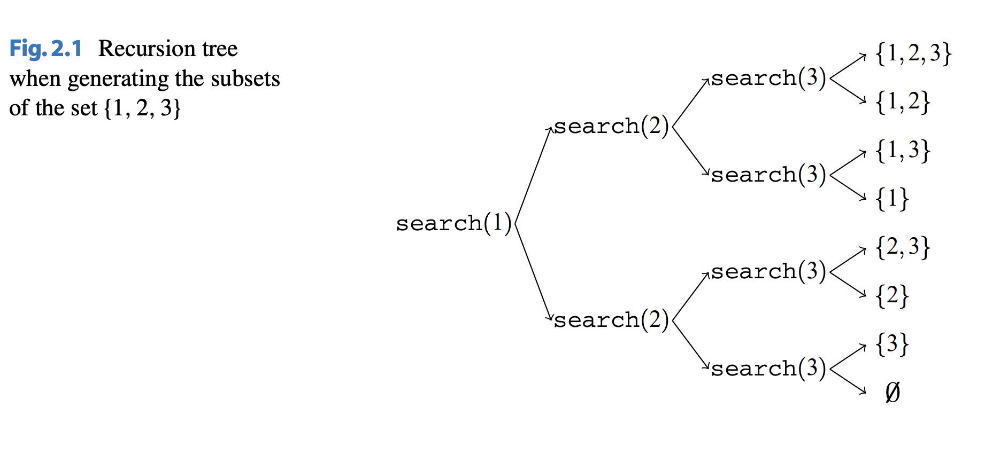

# Recursive Algorithms

## About

Recursion is a method of solving problems where the solution depends on solutions smaller instances of the same problem.

([Source](<https://en.wikipedia.org/wiki/Recursion_(computer_science)>))

([Source](https://algodaily.com/categories/recursion))

## Generating Subsets

An example of recursion is generating subsets (also known as the power set of a set in Discrete Math). For example, the subsets of $arr = \{ 1, 2, 3 \}$ is $P(arr) = {\emptyset, \{ 1 \}, \{2 \}, \{ 3 \}, \{ 1, 2 \}, \{ 1, 3 \}, \{ 2, 3 \}, \{ 1, 2, 3 \}}$ respectfully. To generate subsets, we maintain a vector $subset = \{\}$ storing the current subset we are generating. The code for this can be found [here](subsets.cpp). The recursion tree (a graph of all the operations of $f(n)$) for $n = 3$ is shown below:

At each function call, either we go to the upper branch ($k$ is included in the subset) or the lower branch ($k$ is not included in the subset) for $k$ where $k \in arr$.

## Generating Permutations

Another example of recursion is generating permutations. A permutation can be formally defined as a reordering of the array $arr = \{a_1, a_2, ..., a_{n - 1}, a_n\}$ to $arr = \{a_1\hat{}, a_2\hat{}, ..., a_{n -1}\hat{},  \ a_n\hat{} \ \}$. The code for this can be found [here](permutation-recursion.cpp). For a better solution, C++'s built-in `next_permutation` can be used. Learn more about it [here](../cpp-stl/permutation.md).
