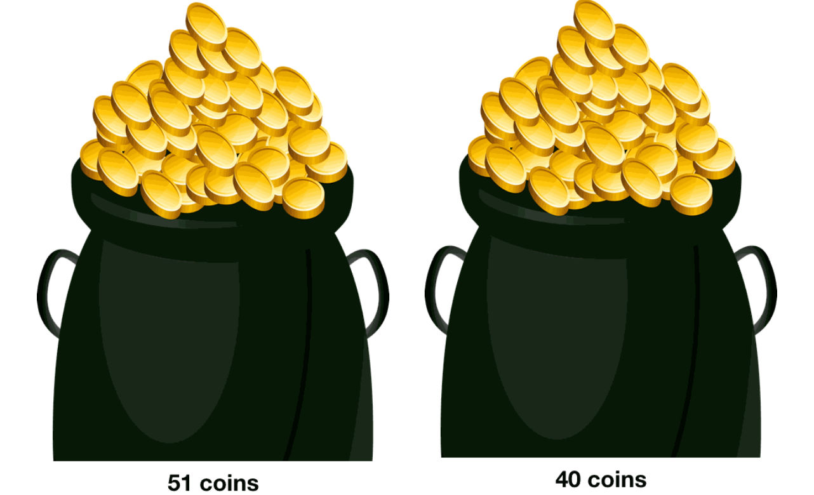

# Dynamic Programming (DP)

## What is Dynamic Programming?

**Dynamic programming** (known as DP) is a programming paradigm that stores the result of a problem after solving it. Essentially, DP is brute force, but with a trick: it stores the subproblems that are already computed to avoid recomputation. A DP solution will examine the previously solved subproblems and will combine their solutions to give the best solution for the given problem.

## The Idea Behind Dynamic Programming

Imagine you are given two bags of coins and you are asked to count the # of coins in the first bag. (There are $51$ coins in the first bag.) Then, you are asked to compute the total # of coins in **both** bags ASAP. Would you count the # of coins in the first bag again? **No!** Since we already know the # of coins in the first bag, all we have to do is add the # of coins in the second bag to the # coins in the first bag (which is $51$). This is the idea behind DP.

## The Approaches of Dynamic Programming

### 1. Top-Down Approach (Memoization)

Remember when we solved the Fibonnaci problem using recursion? That is the top-down approach. We start by solving the problem using recursion, and store the results of each subproblem.

In other words, we're basically adding a caching layer to recursion.

$DP = recursion + caching$

---

### **Tip**

The Top-Down approach is also known as Memoization. Memoization is easy to code, but when a lot of recursive calls are required, memoization may call memory issues.

Generally, memoization is slower than [tabulation](https://github.com/aaronhma/algorithms/tree/master/techniques/dp#2-bottom-up-approach-tabulation).

---

### 2. Bottom-Up Approach (Tabulation)

Another way we can use to solve the Fibonacci problem was by starting from the bottom (calculating the $2$nd term, then the $3$rd term, etc.). Similarly, we can do the same in DP.

We create an array $dp$ where $dp[i]$ represents the answer for $fib(i)$. Then, we define our base cases:

$$f[1] = 1$$
$$f[2] = 1$$

Then, for $dp[i]$, we can do the following:

$$dp[i] = dp[i - 1] + dp[i - 2]$$

---

### **Tip**

Though tabulation is hard to code (we need to come up with a specific order when dealing with a lot of conditions), tabulation is _(generally)_ **faster** than memoization.

---

## The Formula to Solve Any DP Problem

1. [Recognize if the problem can be solved with DP](docs/when_to_use_dp.md)

2. Identify the problem variables
3. Express the recurrence relation
4. Identify the base cases
5. [Decide if you want to implement it iteratively or recursively](docs/tabulation_vs_memoization.md)
6. Add memoization
7. Determine the time complexity. Optimize the solution if the time complexity gives us a TLE when submitting.
