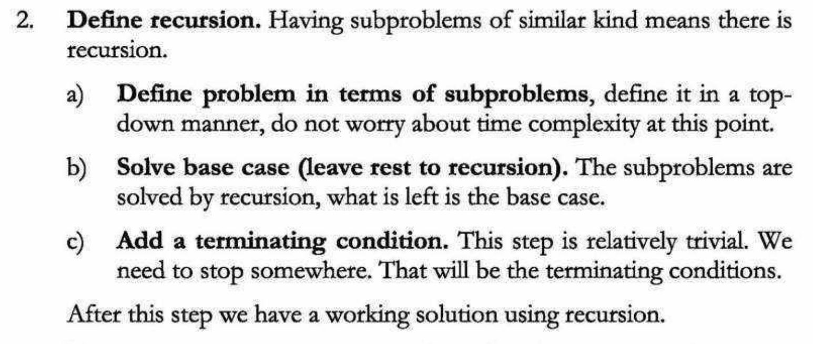

# How to solve Dynamic Programming problems?

## 1. Identify if the problem can be solved with DP

**[When to Use DP?](when_to_use_dp.md)** <-- Read

All DP problems satisfy the overlapping subproblems property and most classic problems also satisfy the optimal substructure property.

## 2. Find a Recursive Solution

The first step to solve any DP problem is to formulate a recurrence relation.



Some key things to think about:

1. The solution should be recursive. If not, the problem probably isn’t a good candidate for dynamic programming. For a lot more info on effectively coming up with a recursive solution, [look here](https://www.byte-by-byte.com/recursion/).
2. Each recursive call must be self-contained. This means that you cannot store your results to a global variable or pass a results variable into your function.
3. It is important that we minimize the number of variables that we are passing into our recursive function. Dynamic programming solutions rely on there being multiple recursive calls with the same input, and the more variables there are, the less the inputs will overlap.

## 2. Analyzing the Recursive Solution

If the recursive solution is already pretty efficient, there's no reason the optimize it more. If the recursive solution is inefficient, we need to optimize it using DP.

## 3. Adding DP

First, take a look at what recursive calls are being made multiple times. Then, identify a way to represent each function call as $dp[i], dp[i][j], ...$, etc.

-   State: Set of parameters that can identify a certain position or standing in the given problem ($dp[i]$)
    (**NOTE: These parameters should be as small as possible to reduce the state space.**)
-   Transition: Recurrence relation - what must be done in order to move between one state to another state ($dp[i] = ... dp[i - 1] ...$)

For example, in the famous [Knapsack problem](../problems/knapsack/README.md), the state is defined by 2 parameters: the index and the weight at the specified index.

## 4. Updating the Implementation

A handy chart for the differences of memoization and bottom-up:


### a. Memoization

Using a `vector` or `map`, store the computed subproblems and check that $f(i)$ doesn't exist in our cache before computing the answer to smaller subproblems.

### b. Bottom-Up

Convert the recursion into a bottom-up approach and redefine our solution in forward direction starting from the most basic case.

## 5. **(OPTIONAL)** Updating the Implementation, Part 2

If the time complexity (time complexity in DP is simple - $\theta(k * |S|)$ where $|S|$ denotes the number of states and $k$ is the time required to compute a state) is still too slow, we can consider reducing the number of states **OR** using an additional data structure to reduce the time needed to compute a single state.

Depending on the problem, we can also bring the space complexity down. For example, in the Fibonnaci problem, instead of using $\theta(n)$ space by storing an entire array, we can bring the space to $\theta(1)$ by using two variables to store $F_{n - 1}$ and $F_{n - 2}$. Note that without an array, we can't directly print $F_k$ ($k \leq n$) in $\theta(1)$. We have to recompute the answer for every query.

<!--
## 3. Formulating a State Relationship

This part is quite hard, and requires intuition, observation, and practice.

**NOTE: In this step, we define what our $dp$ array is. For example, in the Fibonacci problem, we define $dp[i]$ to be the $i$-th number in the Fibonacci sequence. If we realize a $1D$ array is not enough, we go to higher dimensions ($2D$, $3D$, etc.). Also, we can use the constraints to know the dimension of the DP array (eg. if $1 \leq N \leq 2 * 10^4$, a $\theta(n^2)$ will get an AC, so the dimension of the DP array will be $1D$/$2D$).**

For example,

```
Given 3 numbers {1, 3, 5}, we need to tell
the total number of ways we can form a number 'N'
using the sum of the given three numbers.
(allowing repetitions and different arrangements).

Total number of ways to form 6 is: 8
1+1+1+1+1+1
1+1+1+3
1+1+3+1
1+3+1+1
3+1+1+1
3+3
1+5
5+1
```

So, first of all, we decide a state for the given problem. We will take a parameter $n$ to decide state as it can uniquely identify any subproblem. So, our state dp will look like $state(n)$. Here, $state(n)$ means the total number of arrangements to form $n$ by using $\{1, 3, 5\}$ as elements.

Now, we need to compute $state(n)$.

How to do it?
So here the intuition comes into action. As we can only use 1, 3 or 5 to form a given number. Let us assume that we know the result for n = 1,2,3,4,5,6 ; being termilogistic let us say we know the result for the
state (n = 1), state (n = 2), state (n = 3) ……… state (n = 6)

Now, we wish to know the result of the state (n = 7). See, we can only add 1, 3 and 5. Now we can get a sum total of 7 by the following 3 ways:

1. Adding 1 to all possible combinations of state (n = 6)
   Eg : [ (1+1+1+1+1+1) + 1][ (1+1+1+3) + 1]
   [ (1+1+3+1) + 1][ (1+3+1+1) + 1]
   [ (3+1+1+1) + 1][ (3+3) + 1]
   [ (1+5) + 1][ (5+1) + 1]

2) Adding 3 to all possible combinations of state (n = 4);

Eg : [(1+1+1+1) + 3][(1+3) + 3]
[(3+1) + 3]

3. Adding 5 to all possible combinations of state(n = 2)
   Eg : [ (1+1) + 5]

Now, think carefully and satisfy yourself that the above three cases are covering all possible ways to form a sum total of 7;

Therefore, we can say that result for
state(7) = state (6) + state (4) + state (2)
or
state(7) = state (7-1) + state (7-3) + state (7-5)

In general,
state(n) = state(n-1) + state(n-3) + state(n-5) -->

<!-- ## Sources Used

-   [Geeks for Geeks: Solving DP Problems](https://www.geeksforgeeks.org/solve-dynamic-programming-problem/) -->
