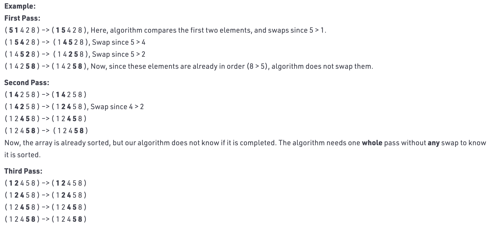

# Bubble Sort [(C++)](./bubble-sort.cpp)

## About

Bubble sort is the easiest sorting algorithm that works in $\theta(n^2)$ time by repeatedly swapping the adjacent elements if they are in wrong order.

## Example

## Time Complexity Proof

It can be shown that Bubble Sort runs in $\theta(n^2)$:

$$\theta((n - 1) \times (n - 1)) = \theta((n-1)^2) = \theta(n^2 - 2n + 1) = \text{Drop constant terms} \ \theta(n^2)$$
